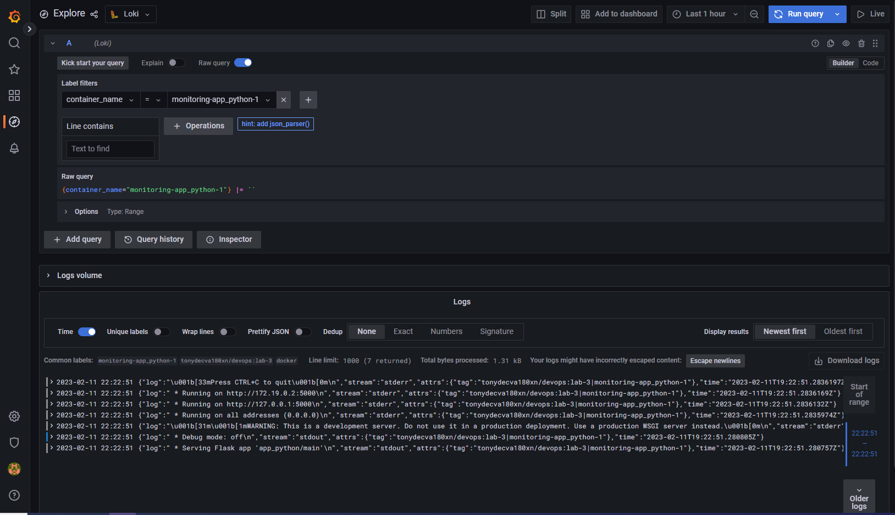

# Logging

For checking the logging system on local machine you need to `docker-compose` file here in `monitoring` folder. It run the app container, as well as Loki, Promtail and Grafana. Last can be opened on `http://localhost:3000`.

Its interface looks like this:

