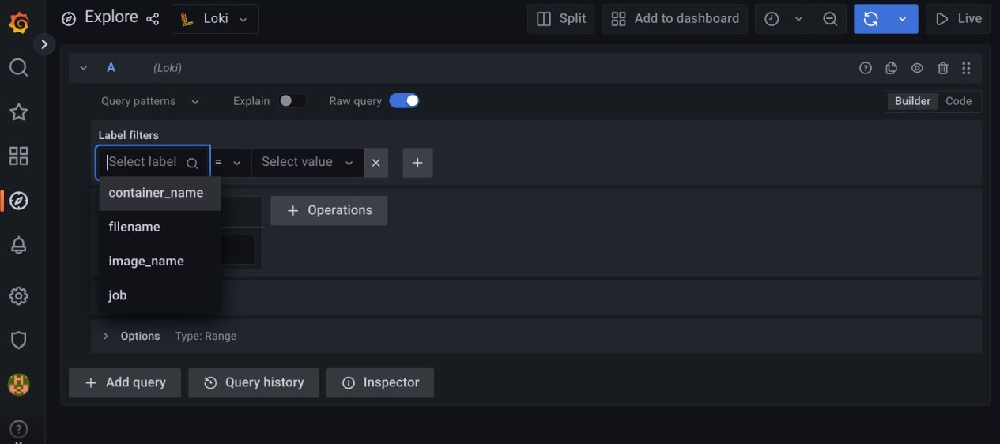
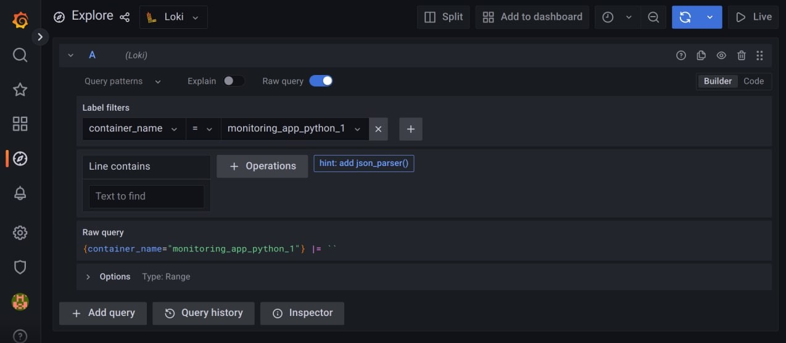
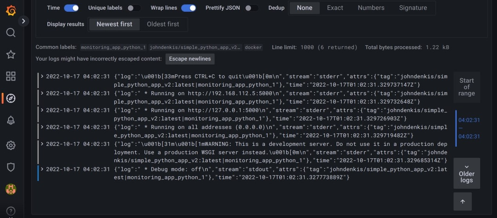
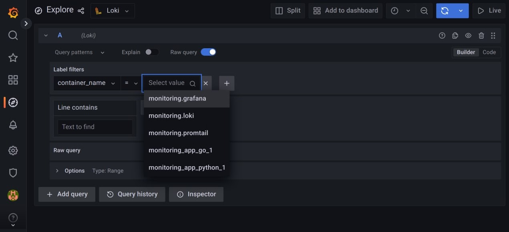
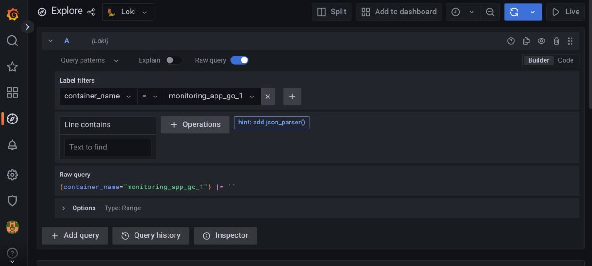
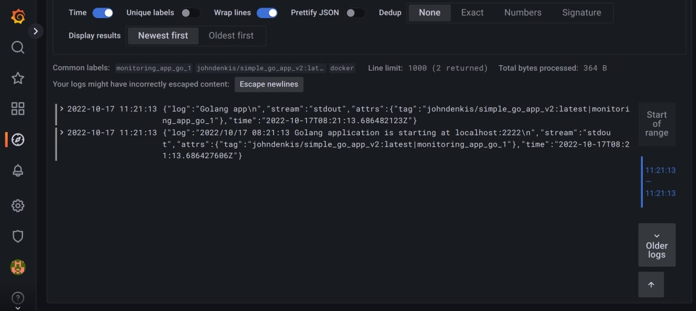

# Logging lab (graphana, loki, promtail)

## HowToRun
Run promtail, loki, graphana and your services with:
```
docker-compose up -d
```
After starting of all containers you can check:
* graphana - http://localhost:3000
* promtail, loki - http://localhost:3100/ready
* go app - http://localhost:8080
* python app - http://localhost:5000

Also, you can check that datasource is connected correctly:
1. Go to graphana http://localhost:3000
2. Click "Explore"
3. Select datasource
4. Go down and click "Test"
5. You will see the result message

If any error, check loki and promtail continer logs.

## Part I: python app

### Labels

We can filter by the following labels:



### Python app container

We can filter by container_name and choose our python app:






## Part II: all containers logs + extra golang app

### All containers

We can see the list of all containers to be filtered:



### Go app container

We can filter by container_name and choose our golang app:




