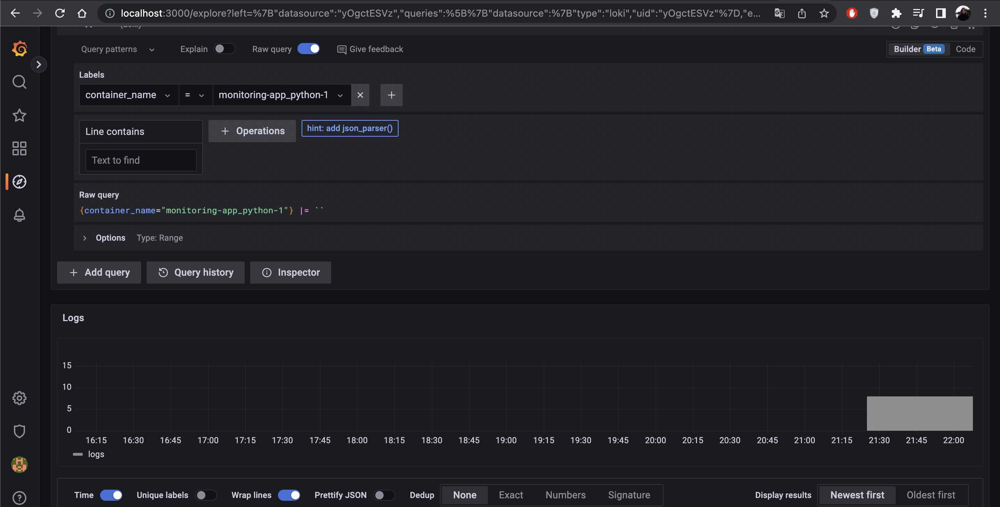
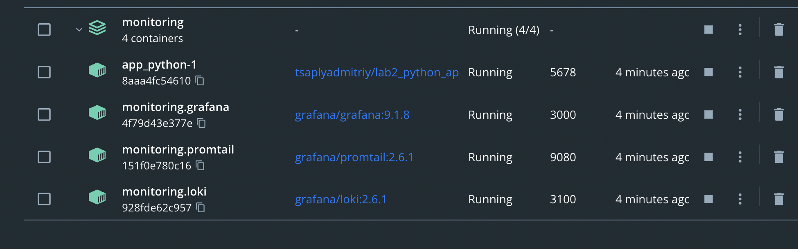

# Logging

`docker compose run`

We start promtail container, promtail container reads logs from app_python container and sends it to loki container. Grafana pulls logs from loki, so that we can see them in web interface.

Collected logs

