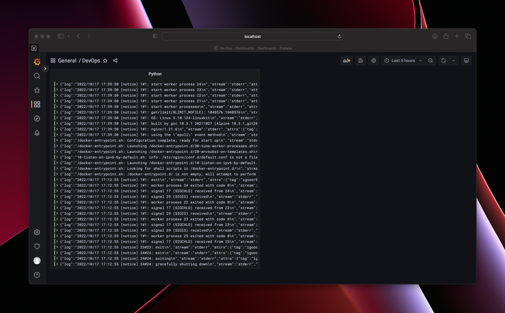

# Logging

The result of the **Loki + Promtail + Grafana** stack setup is as follows:



This collects logs from a web application written in Python and displays them in the Grafana dashboard.

The `docker-compose.yml` file launches the logging stack and the web service consisting of the application and the reverse proxy.

To start an ensemble of services you need to use the following command:

```bash
docker-compose up -d
```

And then go to localhost:3000 to see the Grafana dashboard, which collects application logs.
