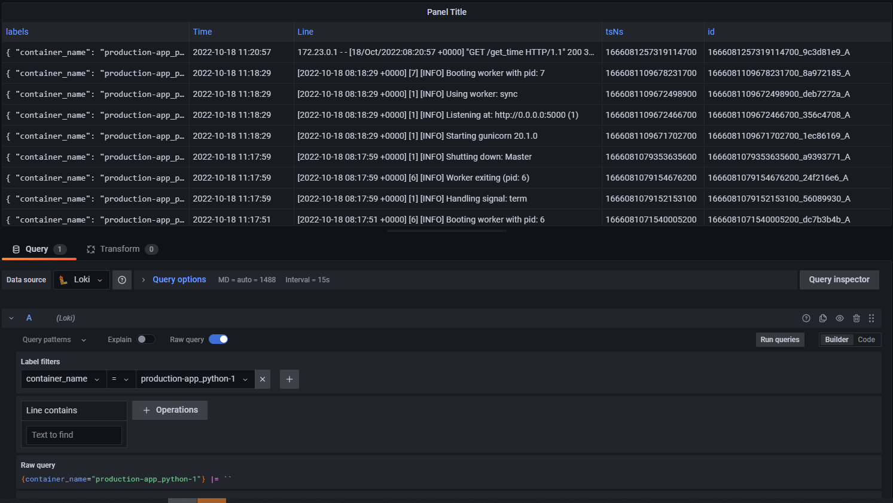
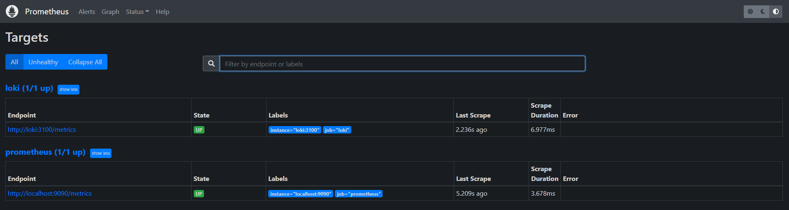
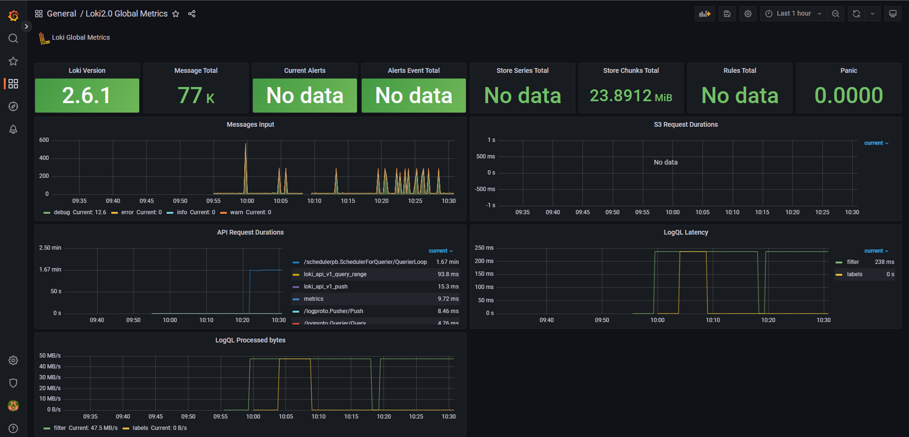
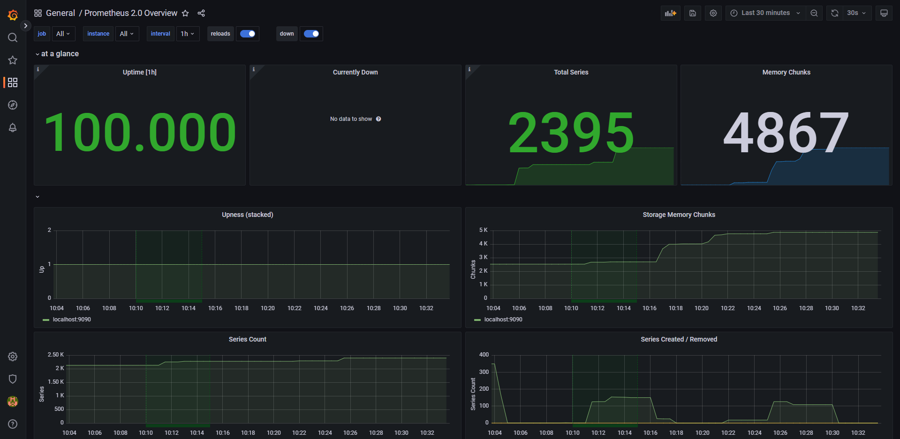

# Logging with Loki

## Running

To run everything on docker:

1. `docker-compose pull` to get all the required images
2. `docker-compose up` to run everything

## Screenshots

### My own custom dashboard with logs for my app, Loki and Prometheus

### Screenshot of `http://localhost:9090/target`

### Loki dashboard

### Prometheus dashboard

