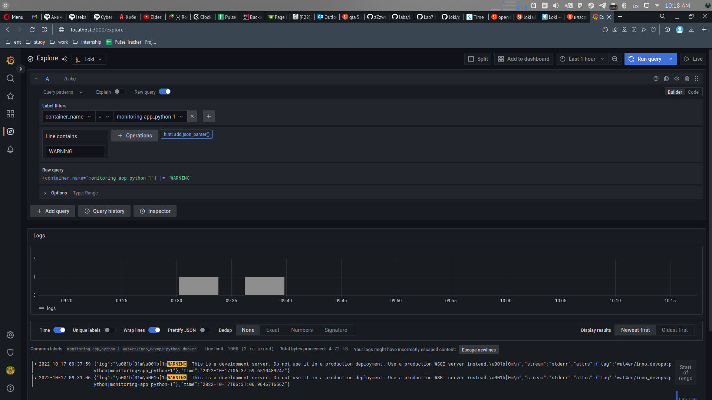
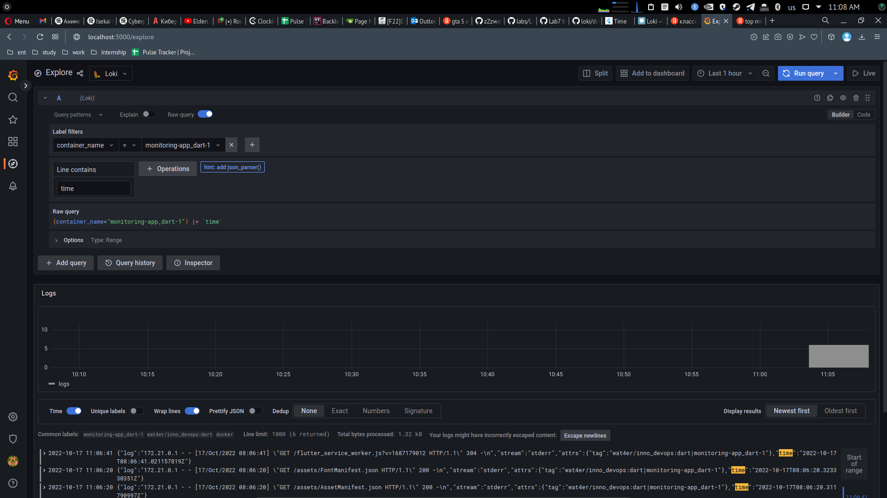

# LOGGING

Monitoring is performed with the use of *Grafana, Loki and Promtail*.

logs are collected with x-logs

## usage

```bash
cd ./monitoring
docker compose up
```

## dashboard

You can access dashboard with localhost:3000

## Results

app python logs:



app dart logs:

