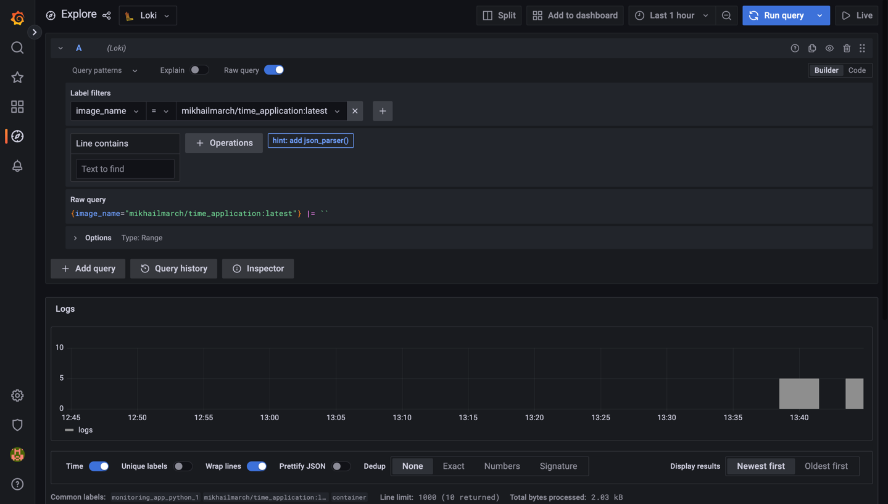

## Logging report

### 1 task

When we start `docker-compose.yml` promtail container will start reading logs 
from python application container and send it to loki. Grafana will pull logs from loki and
show them.

Grafana started at port 3000, enter http://localhoot:3000 and explore it 

Logs collected and shown in grafana

