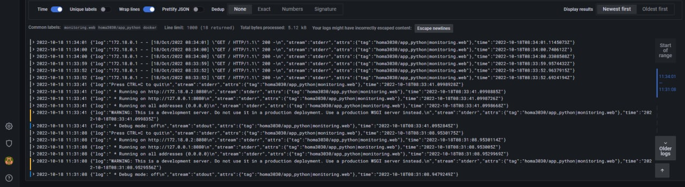
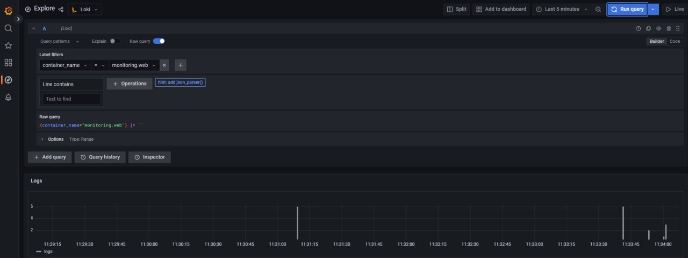

# Report

### Stack:

- `grafana`: Grafana service
- `promtail`: logs provider for `loki`
- `loki`: log aggregation system

## Report

1. Run ```docker-compose up```.

2. Now Grafana can be access at <http://localhost:3000>. 
Use `admin` as both username and password.

3. Loki data sources can be added by clicking the  add data source button ans selecting Loki.

4. Loki can be access with <http://loki:3100>, thus this URL has to be inserted into the required field. "Save & Test" button verifies that all information is correct.


5. Logs:

Logs Chart


