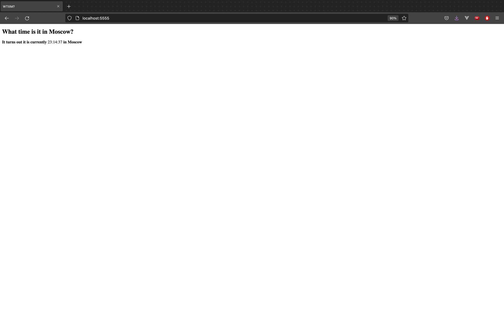
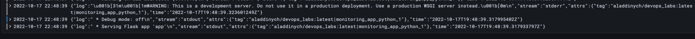

## Grafana Lab 7

1) `cd monitoring`
2) `docker-compose up`
3) Check if the containers are running:

   
4) Check if the app works

   
5) Check if promtail & grafana work

   
6) Navigate to `localhost:3000/explore`
7) Click Live
8) 
9) 