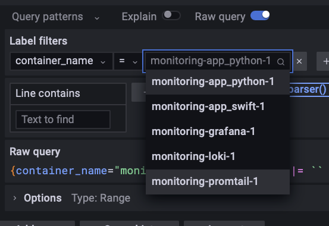
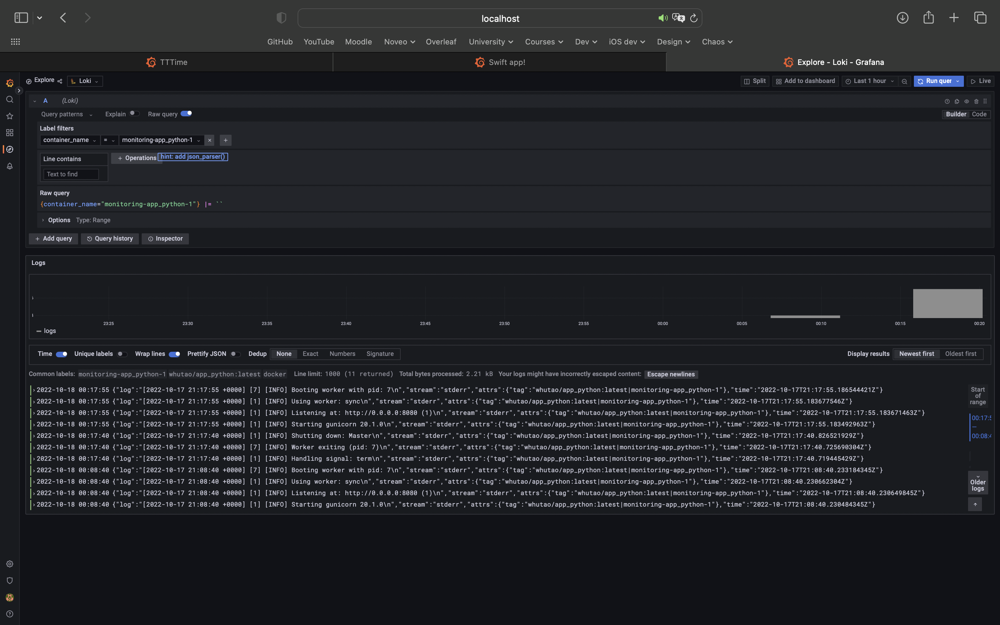
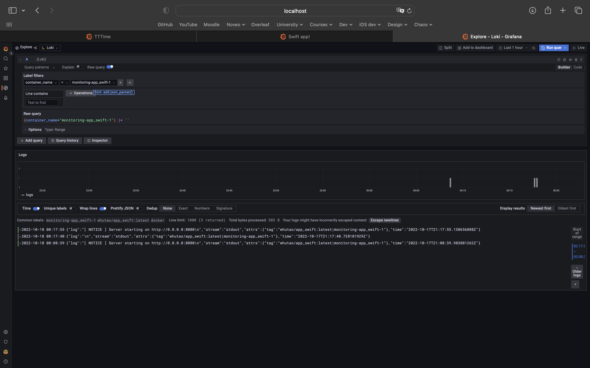

# Monitoring

## Setup

### loki.yml and promtail.yml

The configuration files used by the *docker-compose.yml*.

### docker-compose.yml

Docker compose file declares python and swift applications, loki, promtail and graphana.

## Results

After running `docker-compose up` do the following:

Go to [the Graphana GUI](http://localhost:3000) at *http://localhost:3000*, authorize using login "*admin*" and password "*admin*" and open the explore page. Select the *Loki* source.

Here are some results:

- The list of running containers:

- App python logging:

- App swift logging:

