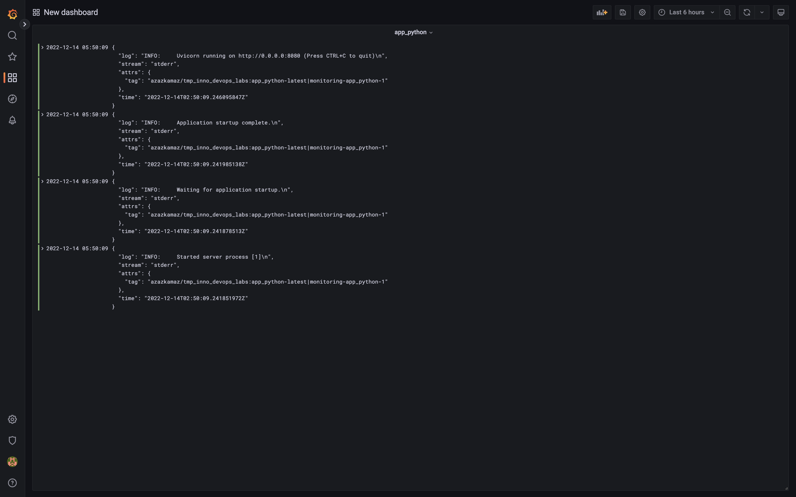

## Lab7

`Promtail` is collecting logs from all containers which are available on the system. For the simplicity it does not filter out current docker compose setup. It does some filtering out logs that are not json, so whn you just simply run this one on the machine there would be nothing extra

`Grafana` is configured to show app_python logs, but any other container logs are also available

