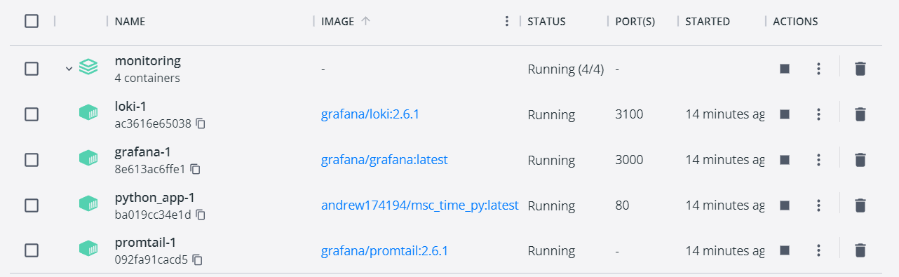
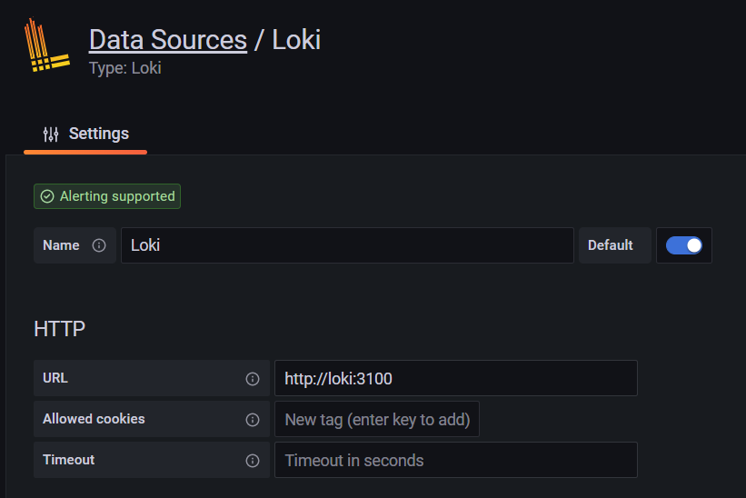
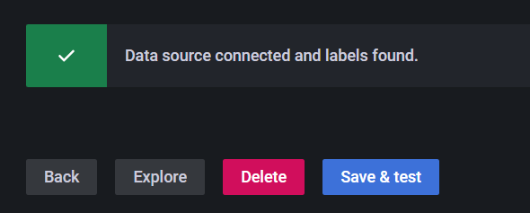
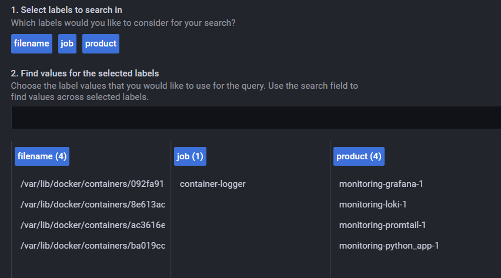
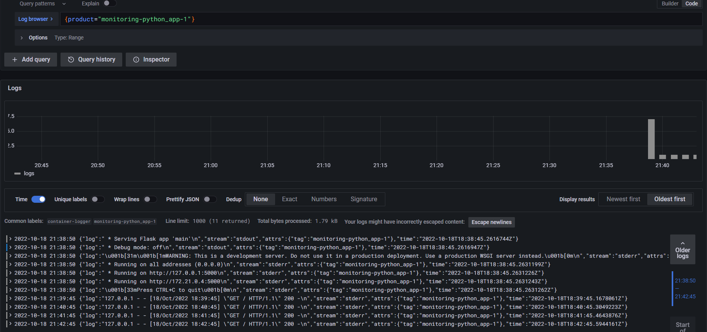

# Logging results

> I want to thank @ntdesmond for his instructions to collect Docker logs to single space and make it available for Promtail.  
    The link to his report - https://github.com/ntdesmond/iu-devops-labs/blob/master/monitoring/LOGGING.md

### Proof of result

First of all, I edited [original docker-compose.yml](https://github.com/grafana/loki/blob/main/production/docker-compose.yaml) as it is convenient for me and composed `promtail.yaml`.

After the `docker-compose up -d` I have the next Docker containers and infrastructure:


From this info we can notice that there are open ports:
- 80 is for application itself
- 3000 is for Grafana hosting
- 3100 is for Loki API

So now we are ready to go to Grafana by entering `localhost:3000` as URL.

Here should add new Loki Data Source as on the picture below:


Click `Save & Test`. In case everything is OK, Promtail is configured, and Loki API is active, we can see ✅. So we're good!


On `Explore` page we can filter labels to show required logs.

On this picture oyu can see available labels and their possible values:


Labels `filename` and `job` are here by default. But they are not convenient for use, that's why I introduced `product` label with source Docker container's name.

The container name is written to log file and set for every Docker by 
```sh
logging:
    tag: "{{.Name}}"
```

So, let me use label `product` and see logs from container `monitoring-python_app-1`
