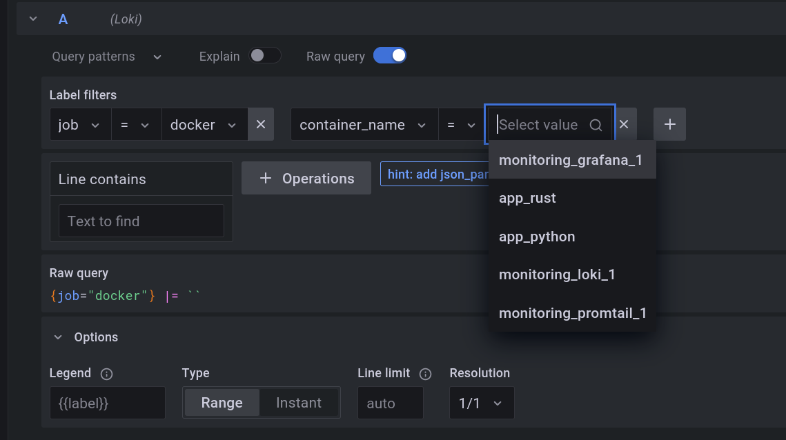
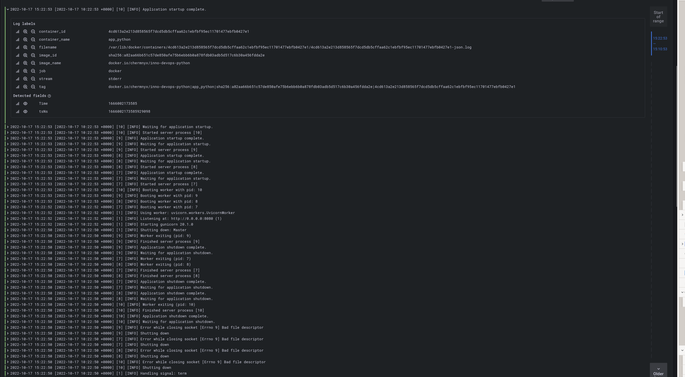

# LOGGING

## Deploying

Run `playbooks/dev/monitoring.yml`

## Using

### Container selection

### app_python logs

### app_rust logs

Note: the rust app itself does not log anything when it's started.

