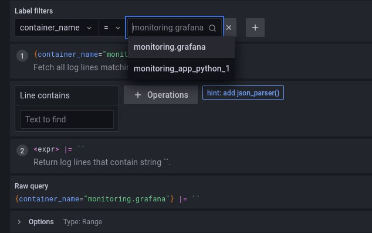

# Logging report

- I create `docker-compose.yaml` and configs for loki and promtail, write all paths to files
- After that run `docker-compose up`
- Go to `http://localhost:3000` and run query for getting logs from `loki`
- Screens with results:\

