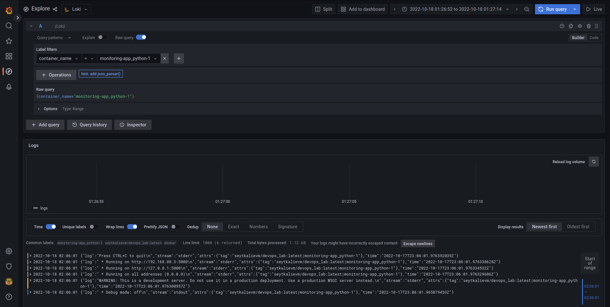
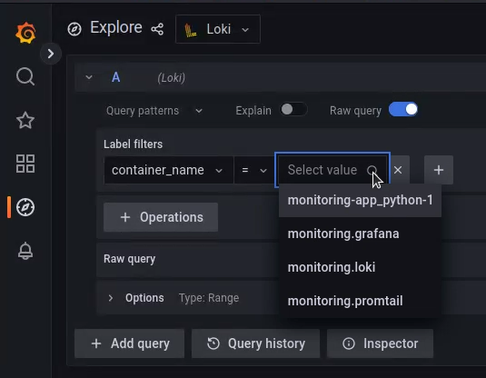

# Monitoring: logging

## Running

To get the logs run

```bash
docker compose up
```

After that see logs at http://localhost:3000

## Output

The logs of python application:



## Bonus task

The stack gets the logs from all containers


