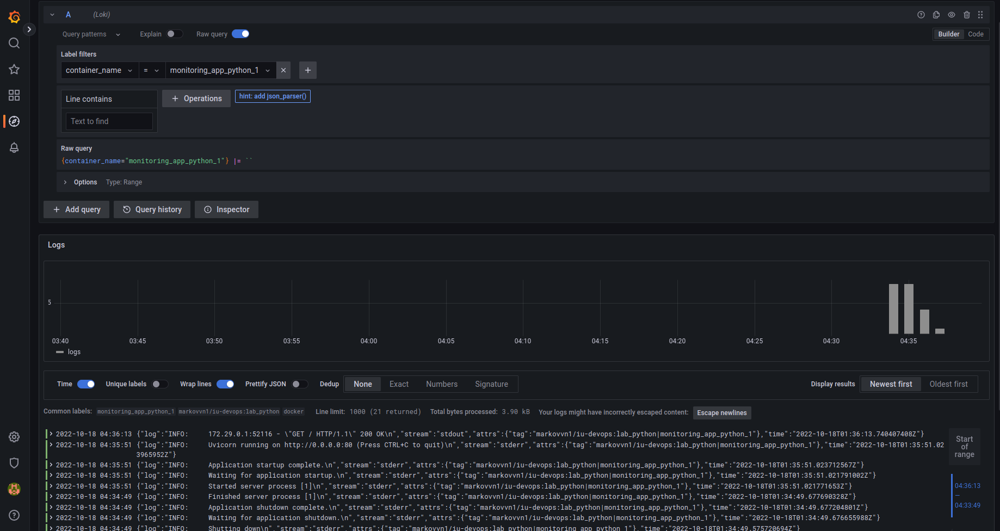
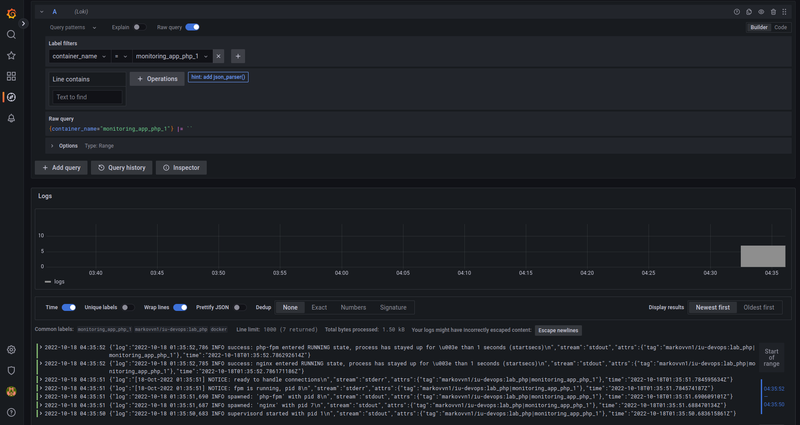

# Monitoring

Monitoring is performed using the following technology stack:

- **Promtail** is the agent, responsible for gathering logs and sending them to Loki
- **Loki** is the main server, responsible for storing logs and processing queries
- **Grafana** for querying and displaying the logs

## Quick start

```bash
cd monitoring && docker-compose up
```

**Grafana** available here: [http://localhost:3000 ](http://localhost:3000)(admin/admin)

## Screenshots

Showing logs of `app_python`:



Showing logs of `app_php` (bonus task):

