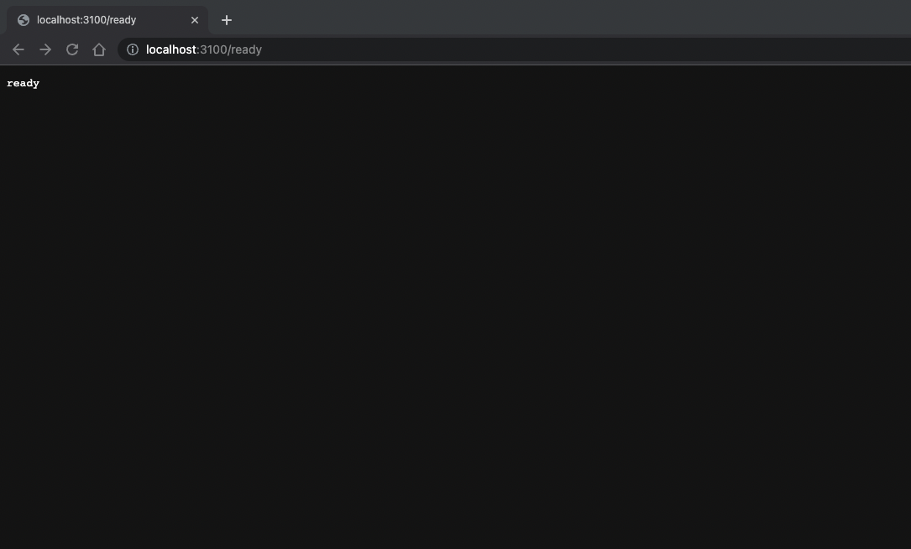
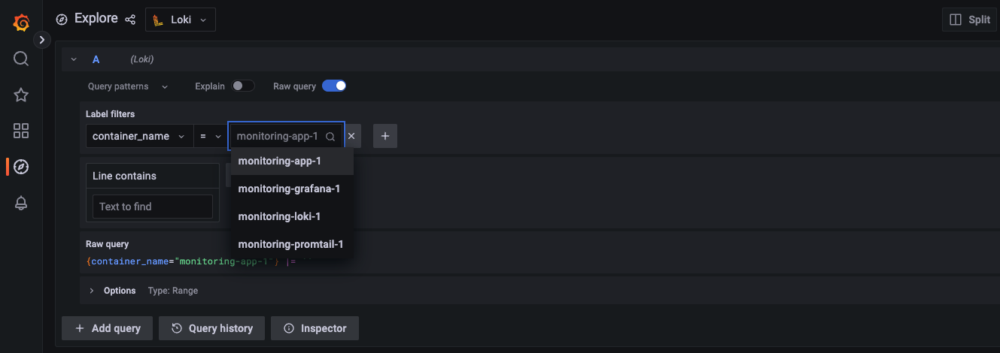
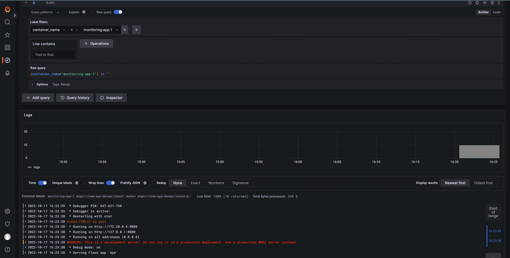
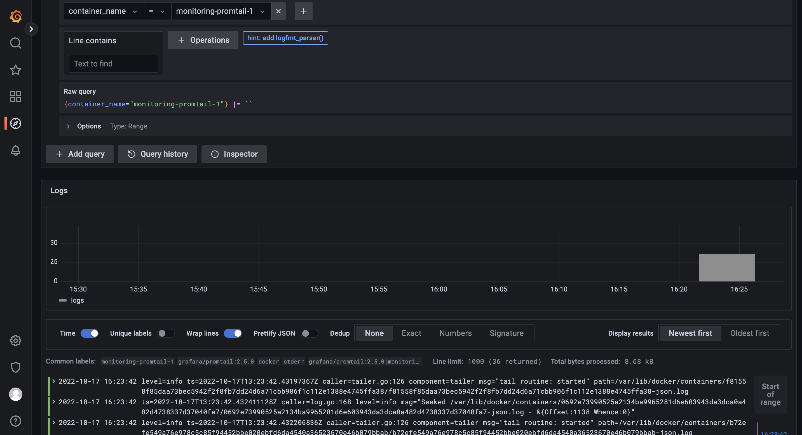

# Logging Report

## 1. How to run

To start all the containers, use:

 ``` docker-compose up -d ```

After the containers start, you can check them on:

- Flask App: [http://localhost:8080/](http://localhost:8080/)
- Grafana: [http://localhost:3000/](http://localhost:3000/)
- Loki: [http://localhost:3100/](http://localhost:3100/)

You can also check Loki logs and status using:

- [http://localhost:3100/ready](http://localhost:3100/ready)



- [http://localhost:3100/metrics](http://localhost:3100/metrics)


## 2. All containers logs

All containers are now visible with container tags:



## 3. Flask app logs

The logs to the app can also be retrieved:




## 4. Promtail logs

Promtail logs are also available:



