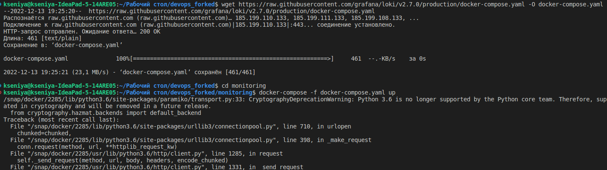
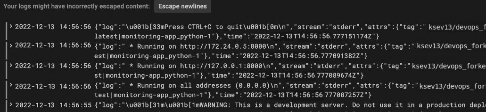

# Lab 7

## Monitoring: logging

In this lab I got familiar with a logging stack - Promtail, Loki, Grafana. To setup the stack, I have preparedS a docker-compose file and config files

1. Firstly, I have read about the logging stack:

   * https://grafana.com/go/webinar/loki-getting-started/
   * https://grafana.com/docs/loki/latest/overview/

1. I installed Grafana Loki with promtail by using Docker Compose and then tested it:

    ```bash
    wget https://raw.githubusercontent.com/grafana/loki/v2.7.0/production/docker-compose.yaml -O docker-compose.yaml
    sudo docker-compose -f docker-compose.yaml up
    ```
    

1. I slightly changed a docker-compose file for the stack and my app. I also configured stack to get logs from all containers from docker-compose.yml.

1. To test that it works, the command 'docker-compose up' was used once again.

    

1. After navigating to http://localhost:3000, we can try to run a query:

    

1. Or to see logs:

    
