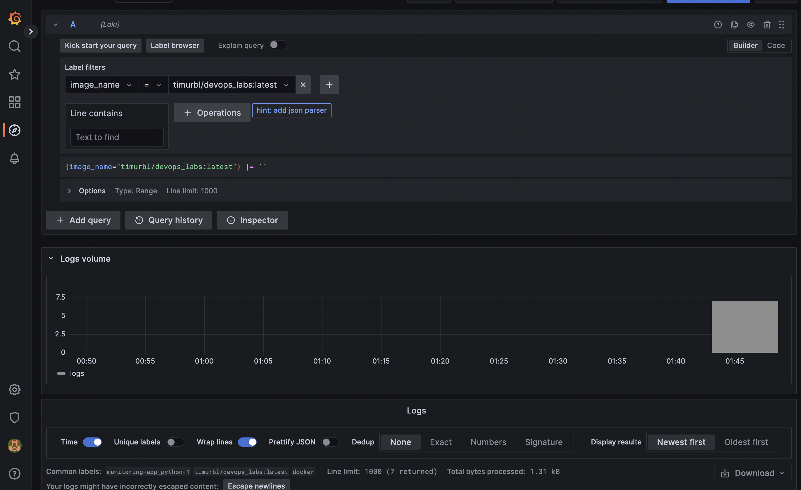

# Monitoring: logging

My logging stack - Promtail, Loki, Grafana.

1. To start, ran the command

```
    docker-compose up
```

2. Open localhost:3000
3. Try to run some queries in http://localhost:3000/explore



