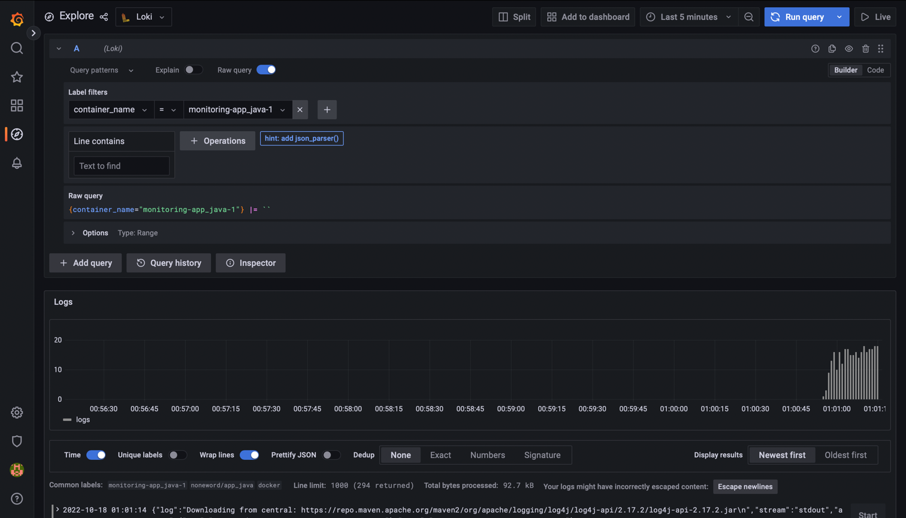

# Monitoring in docker

## Technology stack

* Loki
* Grafana
* Promtail

## Starting 

* run `docker-compose up` inside **monitoring** directory
* go to [logs](http://localhost:3000)
* use **"admin"** as a login and password credentials

## Python app logs

## Java app logs

