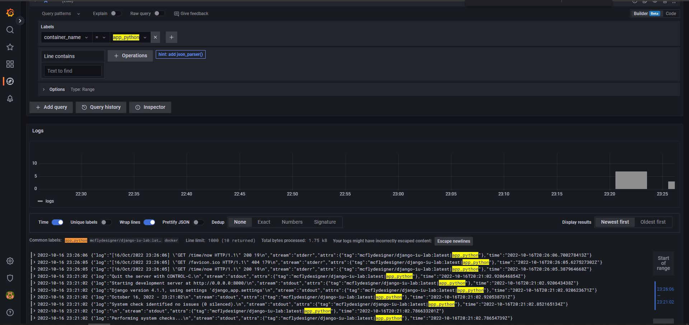

# Monitoring

Monitoring is performed with the use of *Grafana, Loki and Promtail*.

**Logs are collected from all containers using `x-logging`.**

## How to run?

1. Navigate to dir ```monitoring```.
2. Run docker-compose:
```shell
docker-compose up
```
*Grafana* will be available: [http://localhost:3000](http://localhost:3000).

*P.S. Default credentials: admin / admin.*


## Screenshots of work done

### Monitoring of Docker

You may see logs provided when label `job=docker`.


As we can see below, we have logs provided by all containers.


### Monitoring of Python app

You may see logs provided when label `container_name=app_python`.


### Monitoring of Java app

You may see logs provided when label `container_name=app_java`.
