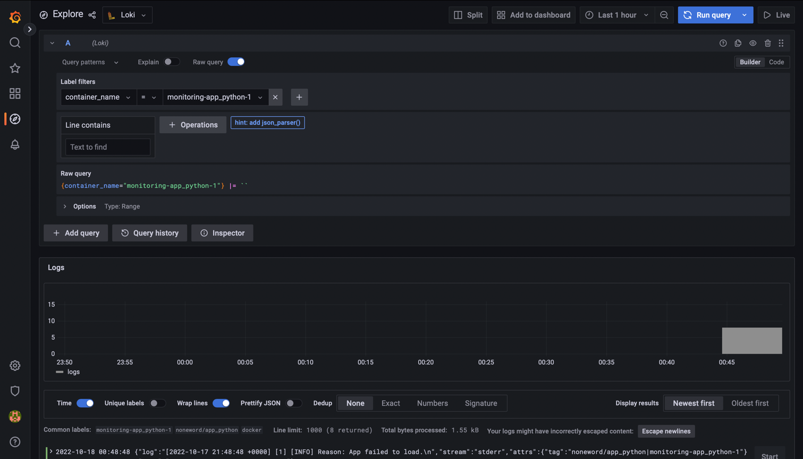

# Monitoring

## Technology
1. promtail
2. loki
3. grafana

## Starting

1. run `docker-compose up`
2. check `localhost:3000`
3. credentials are `admin` and `admin` by default

## Result

### Python

### Java

