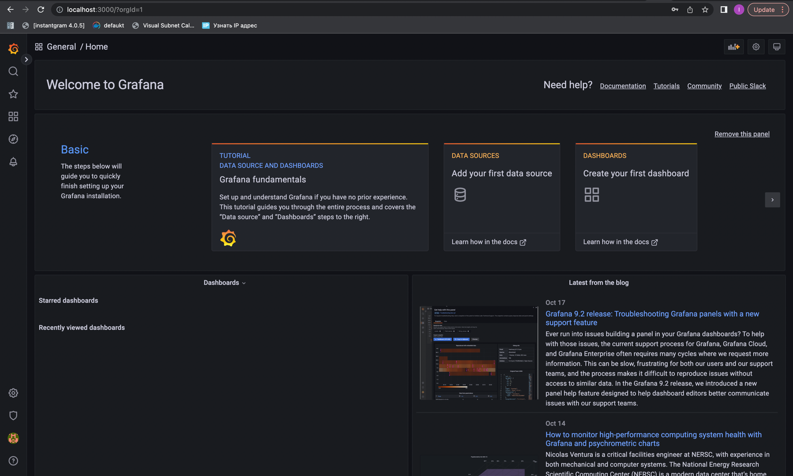

# Logging

## Overview

I am using **promtail** with a config I have found on the web to collect docker logs, put them into **Loki**. I am using **Grafana** to visualize the logs. Grafana has Loki as its datasource.

Here is a screenshot of the logs for my two apps:

## Lab8 Updates

