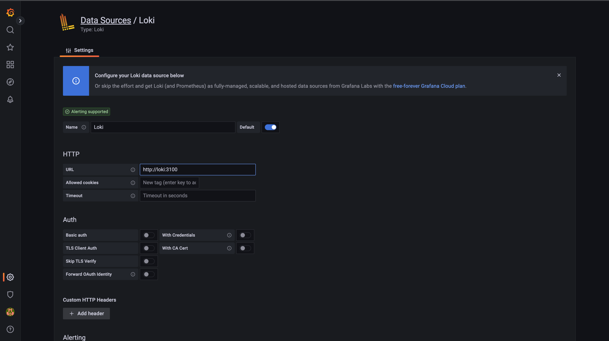

# Docker Compose
You can find three `docker-compose.yml` files in `/app_python`. All services are split into three files,
to be able to run them in local or server environment easily.

### docker-compose-base.yml
It contains only application itself with only necessary services.

### docker-compose-local.yml
This file contains additional services for local development (i.e. local RabbitMQ or Redis).
Also, this file maps all source files (`/src`) inside the container, to avoid building it every time. 

### docker-compose-server.yml
This file contains services, that need in server environment, for example for monitoring (promtail) or 
deployment (watchtower).

## Run
When I need to start local environment I use `docker-compose-base.yml` and `docker-compose-local.yml`
and I need to run application on server I use `docker-compose-base.yml` and `docker-compose-server.yml`.
The exact commands are located in `/app_python/Makefile`.

# Monitoring
Promtail configuration is located at `/app_python/config/promtail-conf.yaml`. In the config I grep only 
application log at `/var/log/app/main.log`. This log is written by application inside other container and 
the file is mapped via docker volume. I do not use any custom config for Loki or Grafana.

# Results
After running containers via `make prod` you can access grafana via `http://localhost:3000`:

Then we need to configure loki as datasource:

And then we can grep logs:

After sending some requests via swagger docs (`http://localhost/docs` with login and password `admin`):

We can find them in grafana:

We can build graphs here or use to find some bugs. To stop all containers run `make down-v`.
