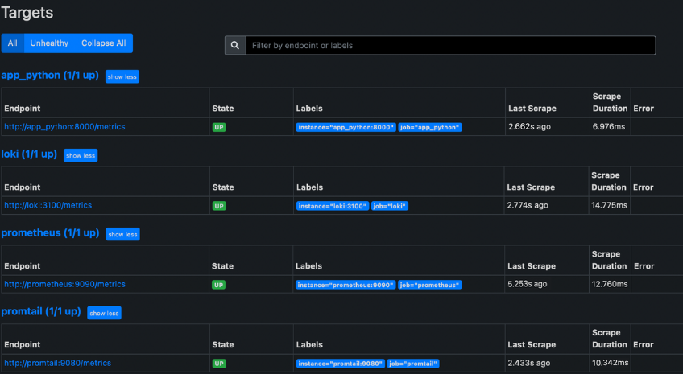
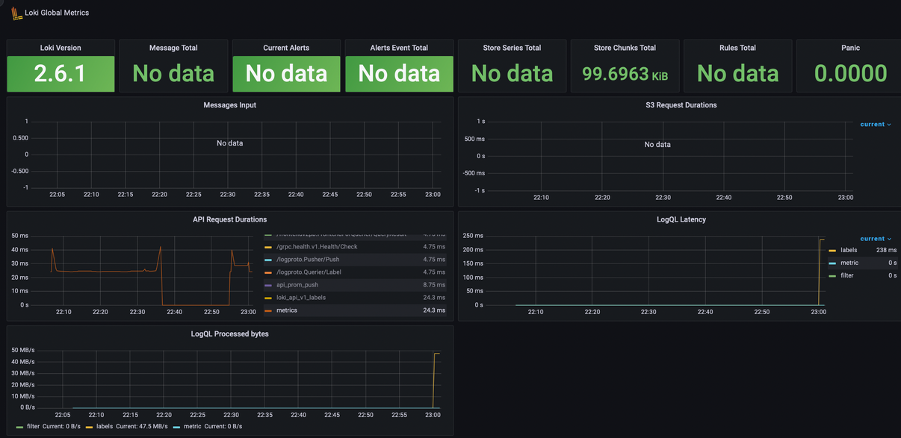
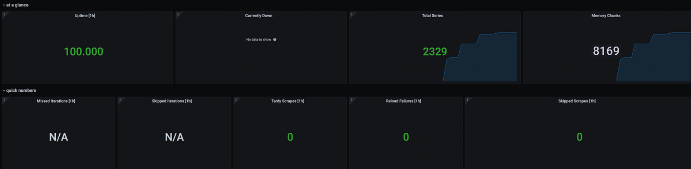

# Lab 8

## Monitoring: metrics

1. I have updated `docker-compose.yml` file from the previous lab with  Prometheus, configured Prometheus to obtain metrics from Loki and Prometheus containers.

1. I added healthcheck, that returns 200 status if everything is correct,
to `docker-compose.yml`.

1. Check `http://localhost:9090/targets`:

    

1. Set up dashboards in Grafana for Loki:
    

1. Set up dashboards in Grafana for Prometeheus:
    
