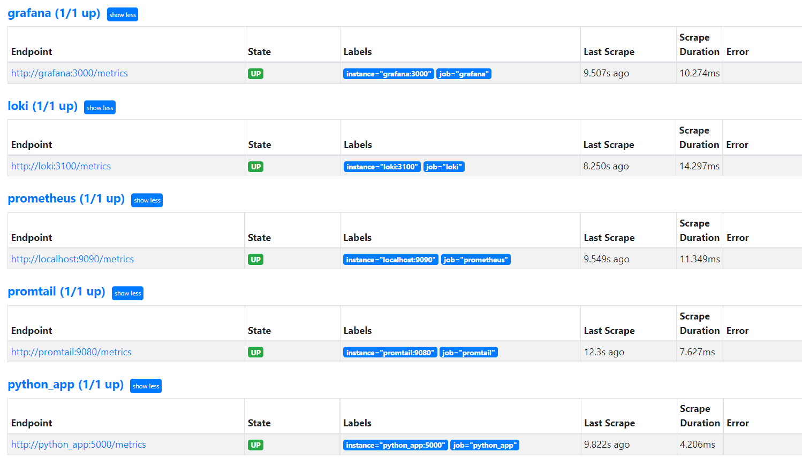
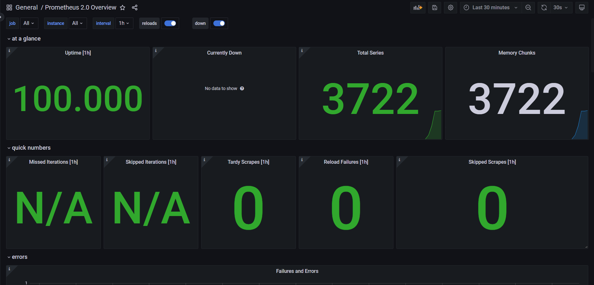
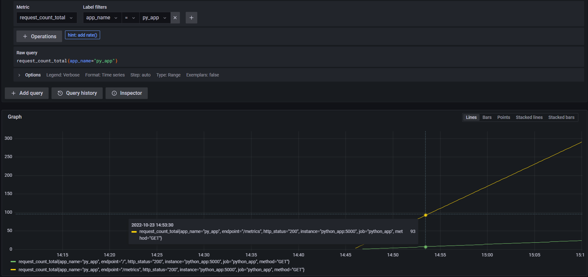

# Tasks result of lab 8 + Bonus

### Metrics for Loki & Prometheus

On the picture below there is a screen of `localhost:9090/targets` with all services that I use for application

### Dashboard

I manually added [Prometheus 2.0 Overview](https://grafana.com/grafana/dashboards/3662-prometheus-2-0-overview/) into Grafana.
  
Dashboard requires Prometheus datasource, so I additionally registered `http://prometheus:9090`

### Metrics for Python app

In python app I added `prometheus_client` which collects metrics and give it to Prometheus when it asks for them.   
In my example, I save <u>request method, request path & returned status</u>.  

Here is a graph with number of `GET /` with status 200 & `GET /metrics` with status 200 requests.
