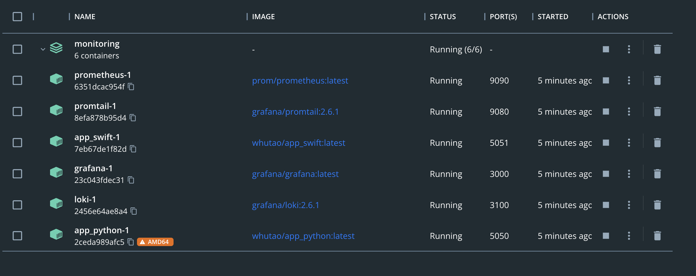
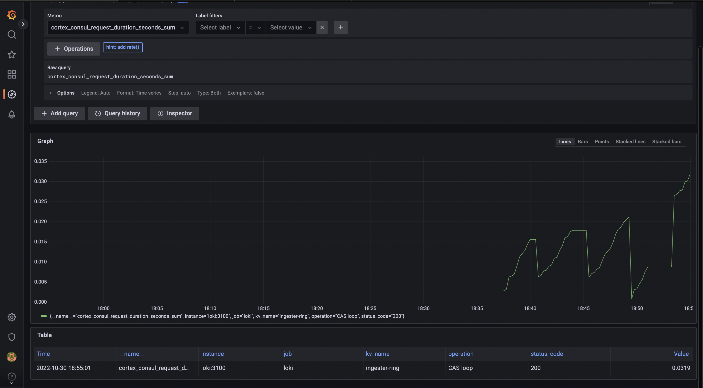

# Metrics

## Setup

After setuping the prometheus and rewriting the *docker-compose.yml*, we can run everything with `docker-compose up`. We can see that our applicaton container is run, as well as the monitoring/metrics environment.

## Prometheus

Go to [the Prometheus GUI](http://localhost:3000) at *http://localhost:9090/targets?search=* for the target list page. See that all the targets are healthy

## Log example

Go to [the Graphana GUI](http://localhost:3000) at *http://localhost:3000*, authorize using login "*admin*" and password "*admin*" and open the explore page. Select the *Prometheus* source. Compose any query you want and test the results. For example,

