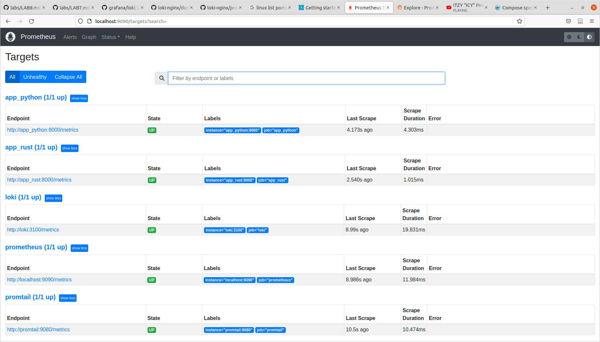
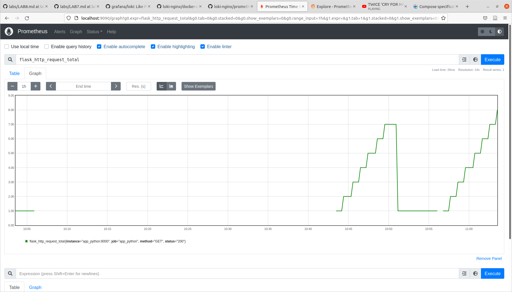
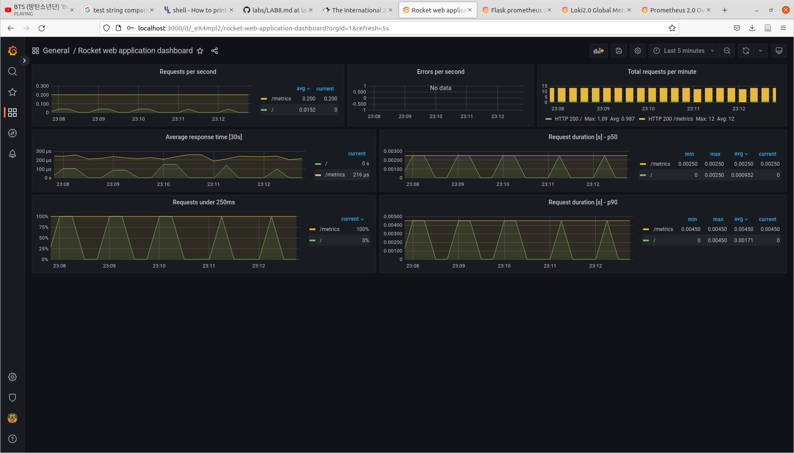
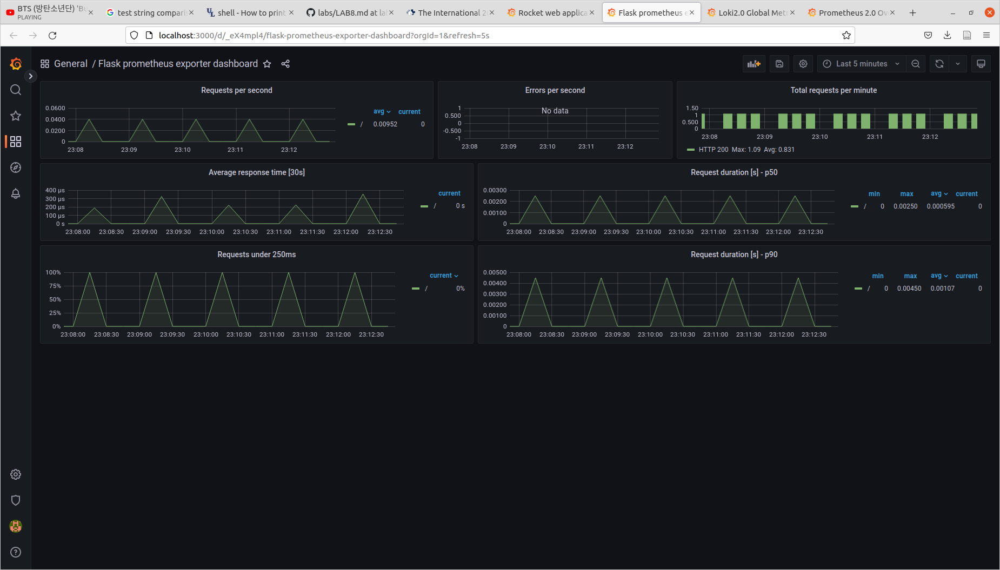
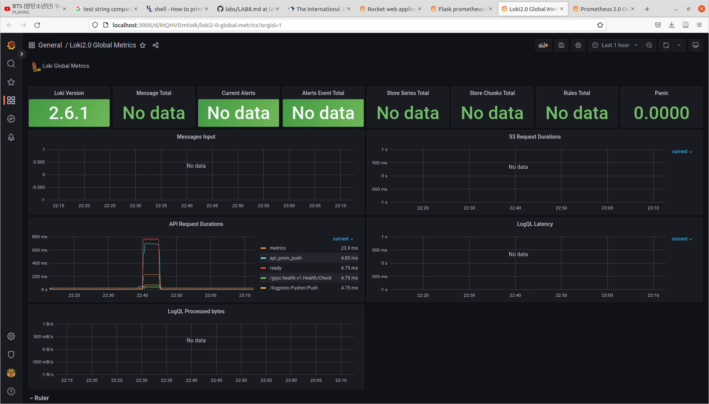
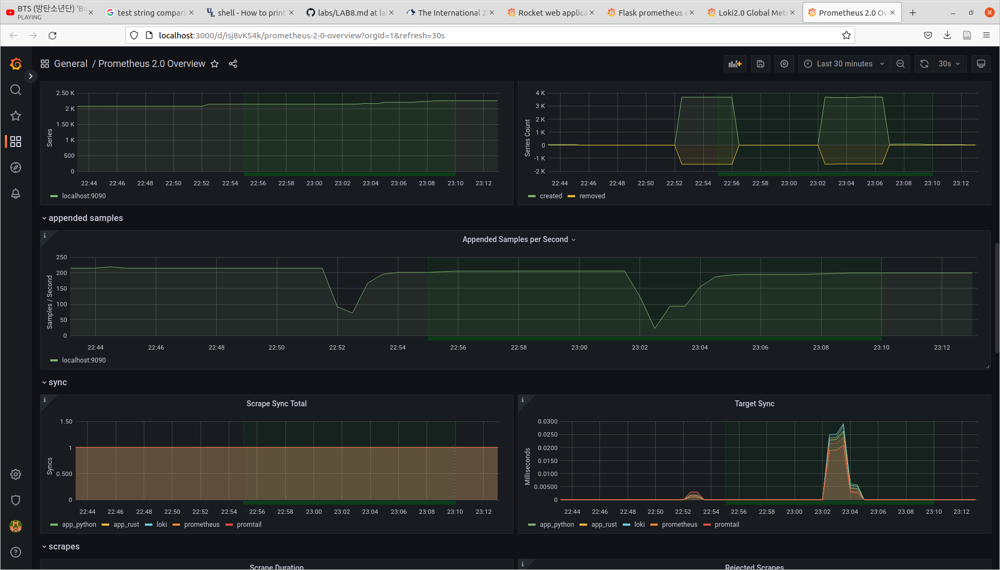
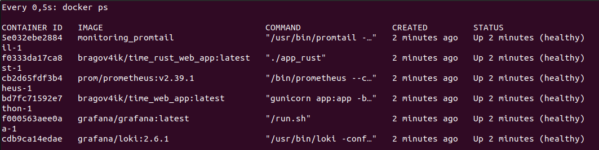

# Metrics report

## 6 points

Prometheus is up and running. It collects metrics (incl. from endpoints added in previous labs) from containers that are specified in config (namely, python/rust apps, itself, loki, promtail).

`/targets` in prometheus:

example of metric graph

## 4 points + Bonus

### Dashboards

Rocket

Flask

Loki

Prometheus

### Healthchecks

