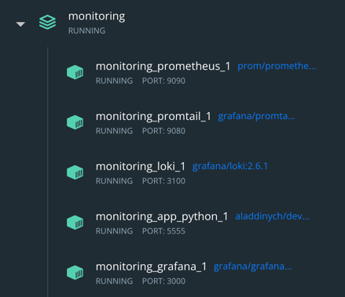
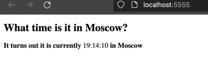
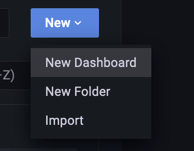
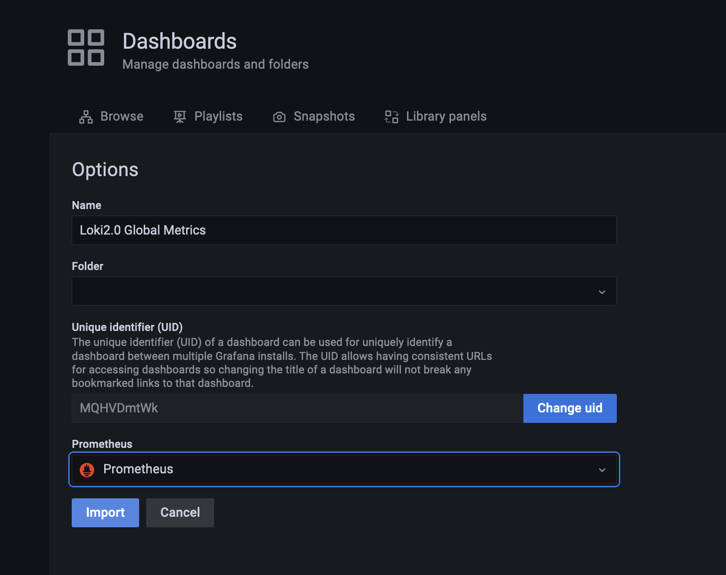
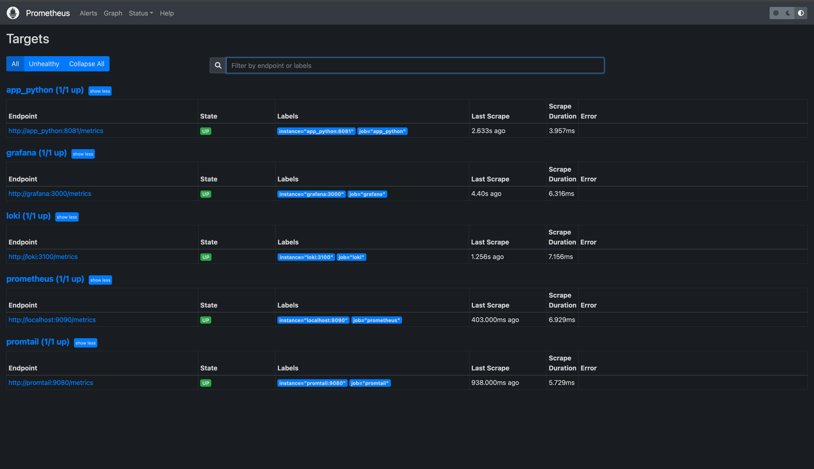
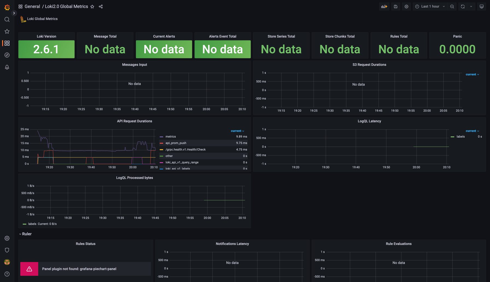
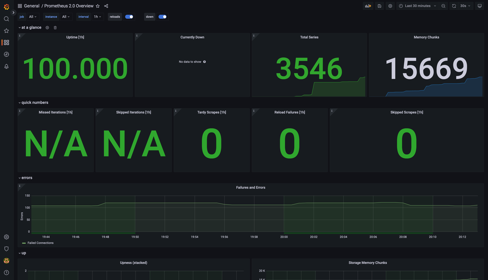
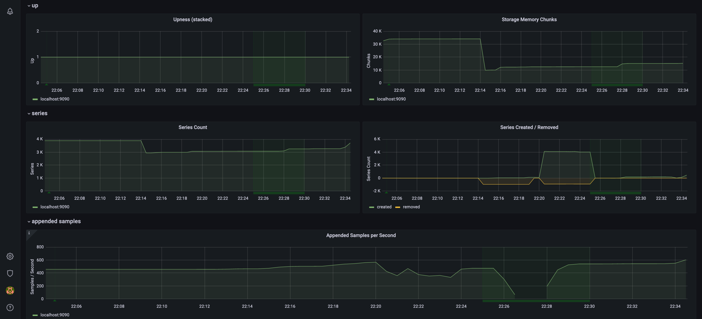

## Metrics
`docker-compose up`

Upload json for these dashboards:
https://grafana.com/grafana/dashboards/13407
https://grafana.com/grafana/dashboards/3662

Metrics:

Loki board:

Prometheus board:

