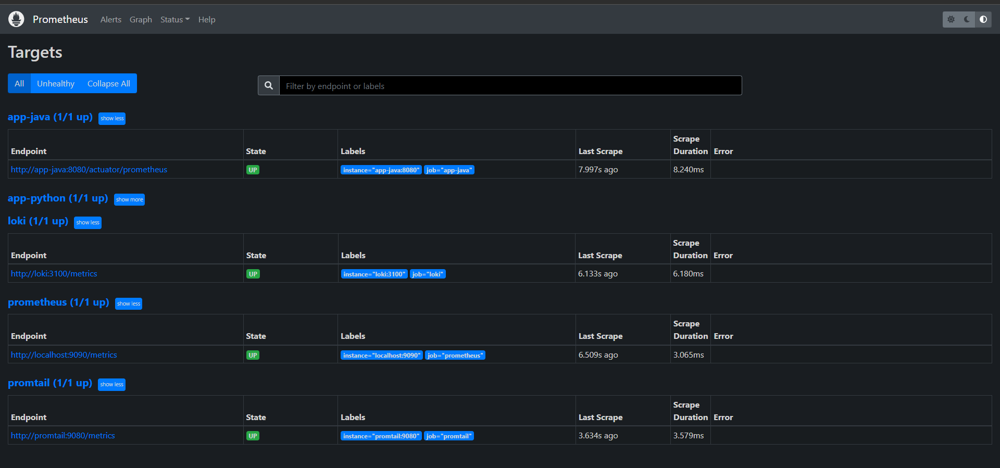
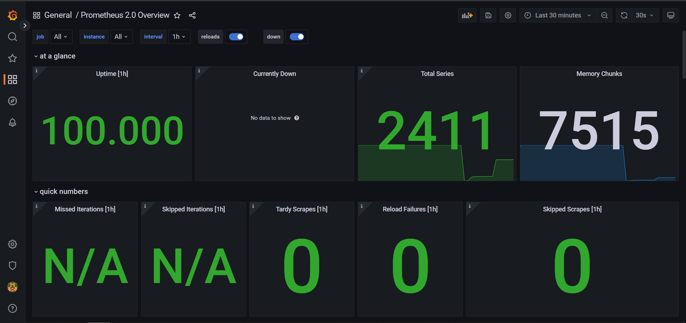
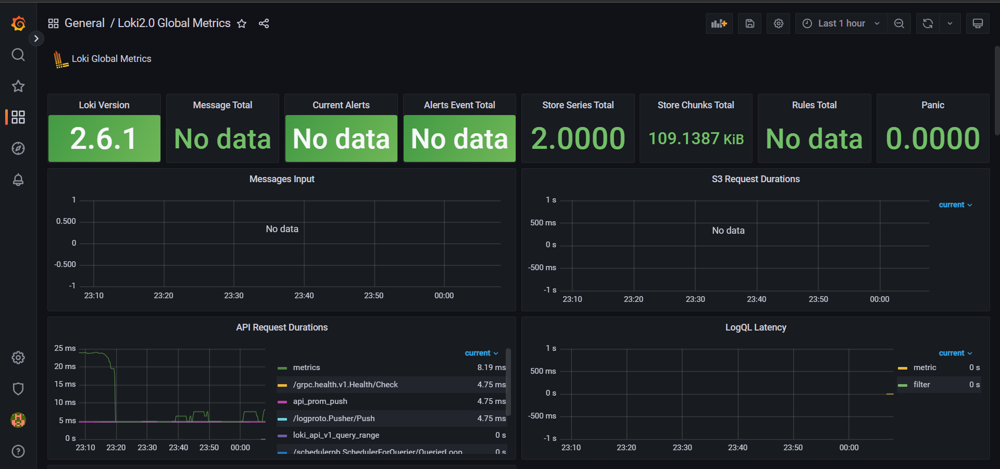
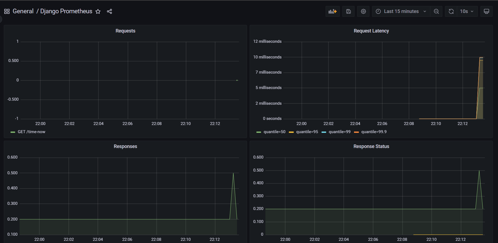
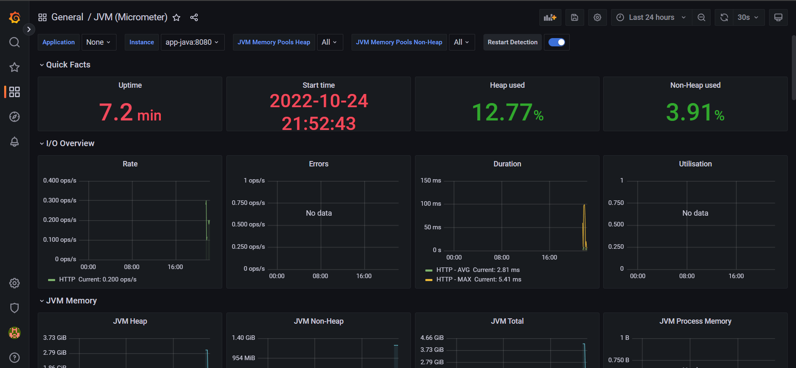

## Metrics - Lab8

## Notes
Log rotation is set using "max-size" and "max-file" parameters for `json-file` log driver.

### Screenshots from `http://localhost:9090/targets`

After I added Python and Java applications, I obtained the following picture:

### Prometheus dashboard in Grafana

I manually imported the following [template](https://grafana.com/grafana/dashboards/3662).

### Loki dashboard in Grafana

I manually imported the following [template](https://grafana.com/grafana/dashboards/13407).

### Metrics for Python app 

I manually imported the following [template](https://grafana.com/grafana/dashboards/9528-django-prometheus/).

### Metrics for Java app 

I manually imported the following [template](https://grafana.com/grafana/dashboards/4701-jvm-micrometer/).

