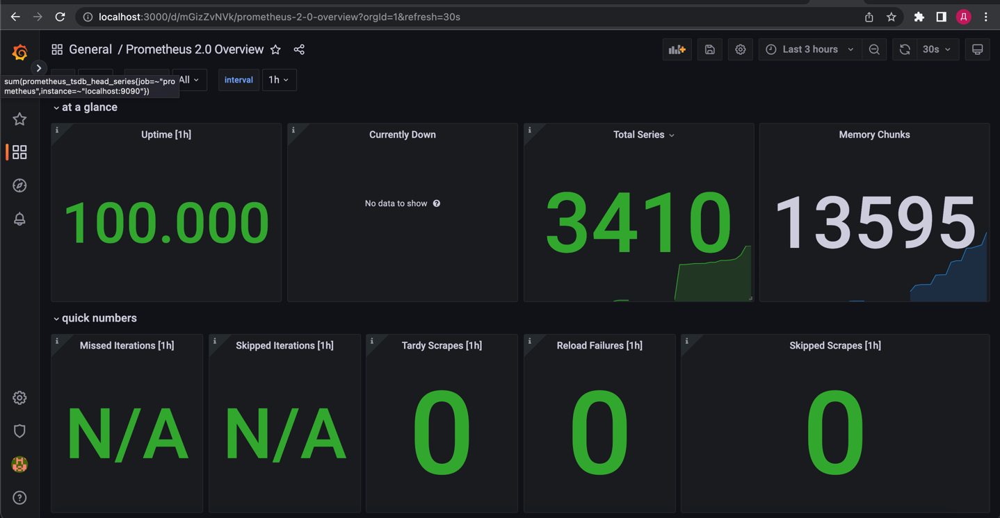
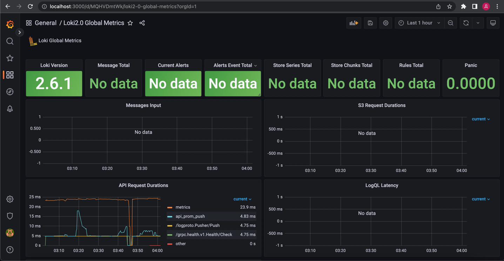

# Metrics

####Let's check http://localhost:9090/targets to see that all of our targets are successfully started

#### Let's create a dashboard to take metrics from prometheus using this [JSON](https://grafana.com/grafana/dashboards/3662-prometheus-2-0-overview/).
#### After creation, let's check that it works correctly:

#### Now let's use [JSON](https://grafana.com/grafana/dashboards/13407-loki2-0-global-metrics/) to create a dashboard with metrics from loki
#### After creation, let's check that it works correctly:
    
