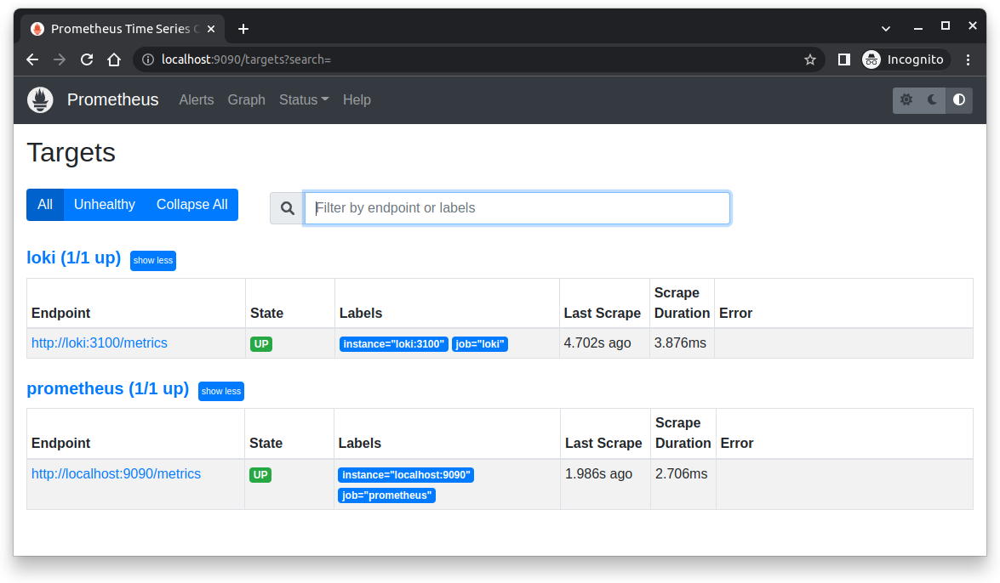
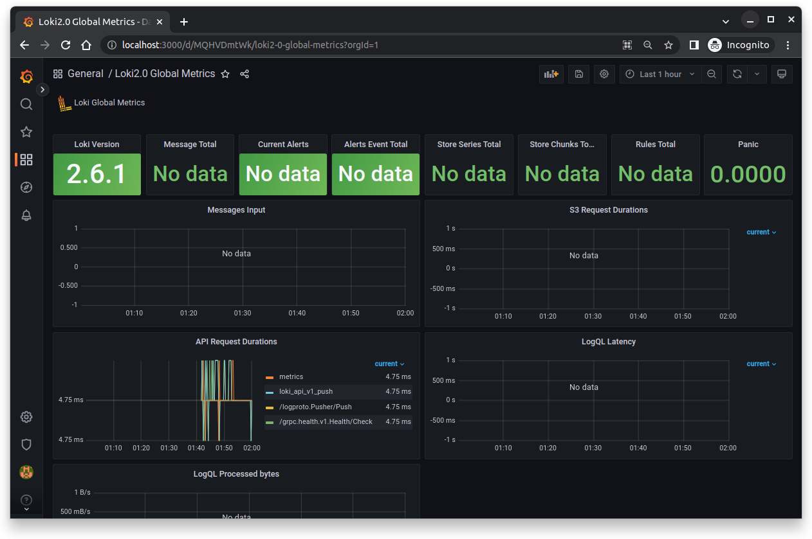
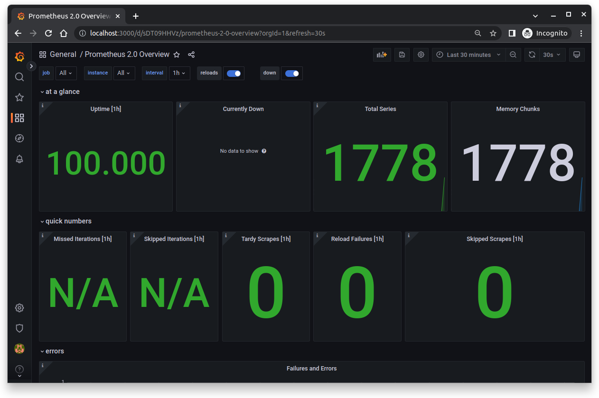
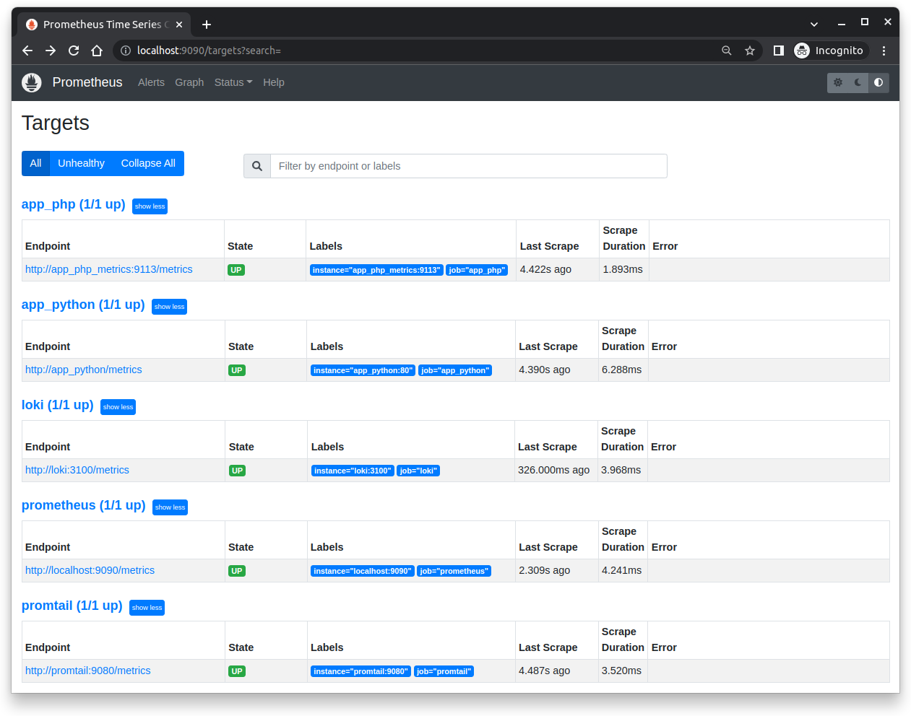
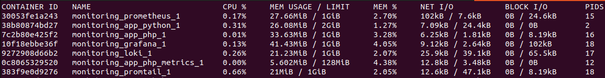
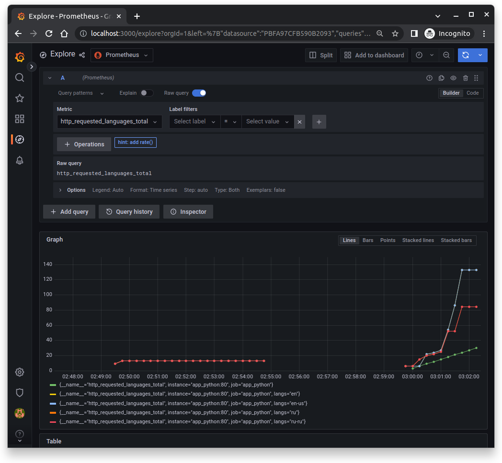
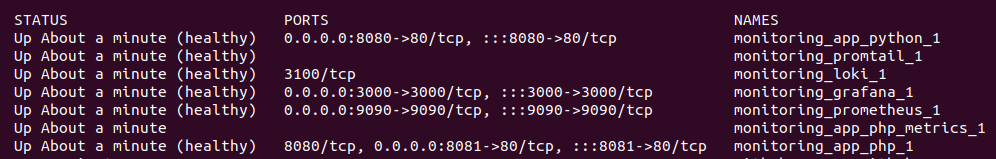

# Metrics

Configured Prometheus to obtain metrics from Loki and Prometheus containers:

Set up dashboards in Grafana for Loki and Prometeheus:

Gather metrics from all services:

Add mem limits for all services:

## Bonus

Add any metrics to your apps (I have added the metric `http_requested_languages_total`):

Update config of all services in `docker-compose.yml` - add healthchecks:

