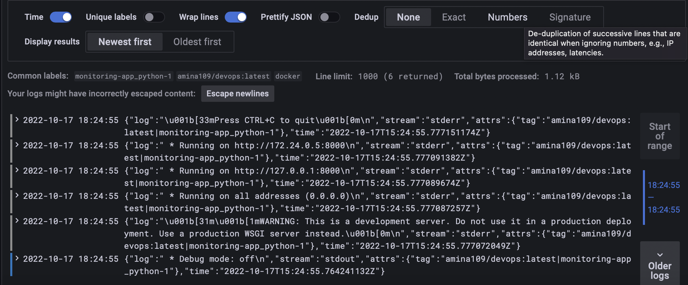
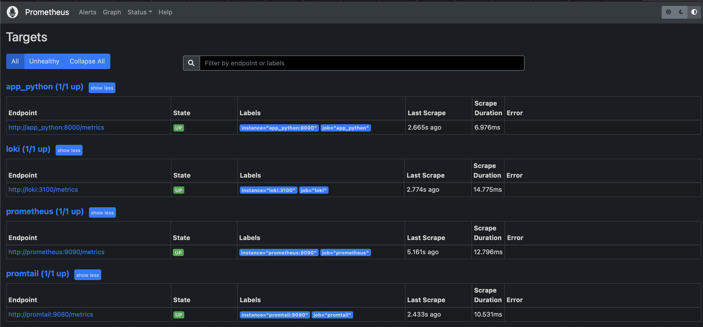
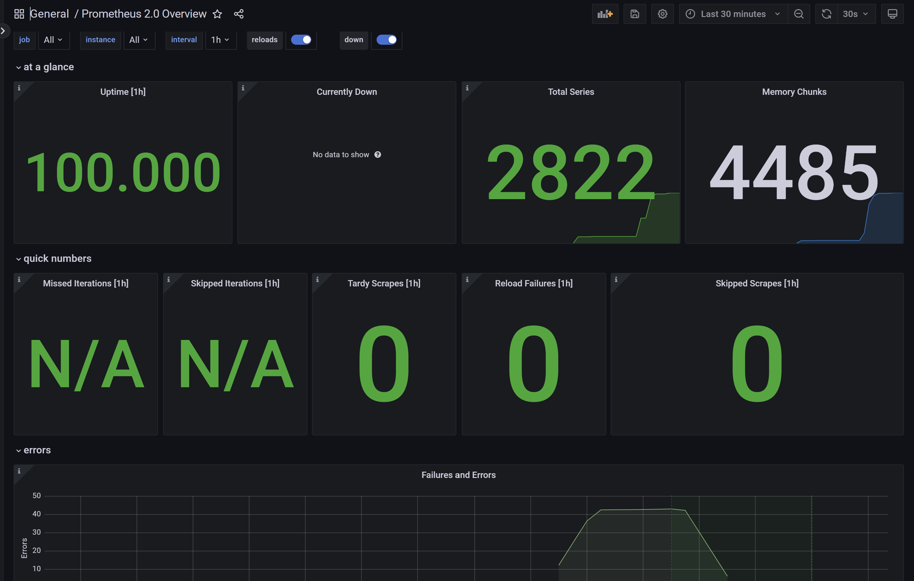
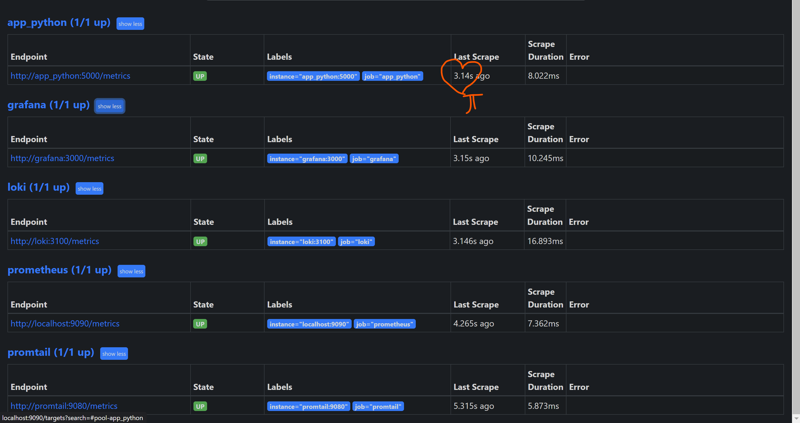

# Metrics

## Configure Prometheus to obtain metrics from Loki and Prometheus containers

## Set up dashboards in Grafana for Loki and Prometeheus

## Gather metrics from all services in the `docker-compose.yml` file

