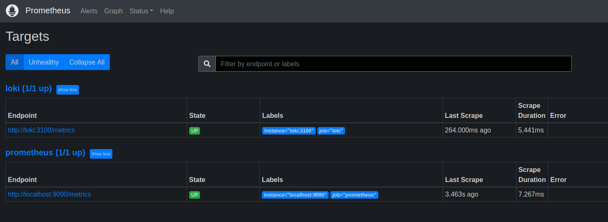
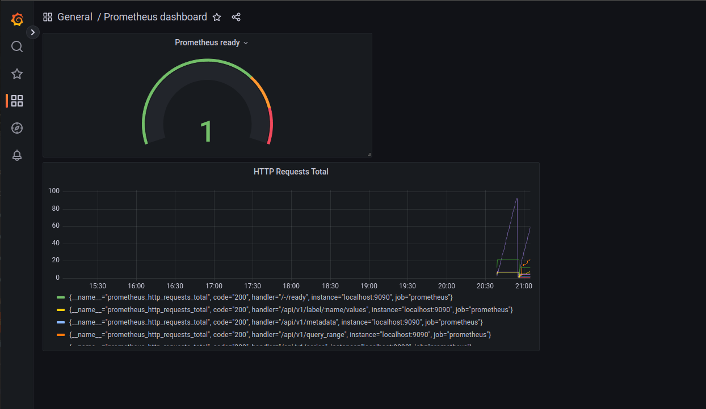
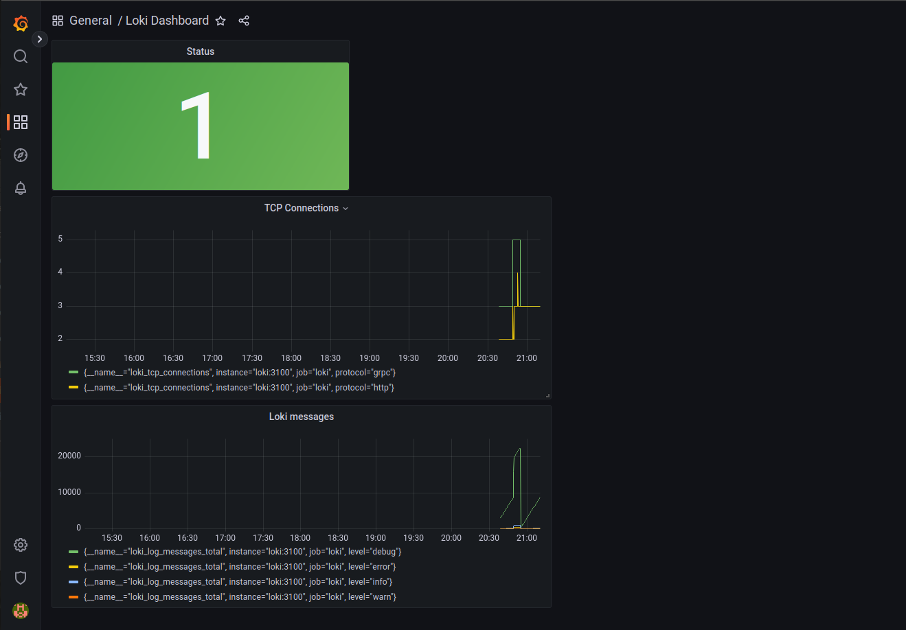
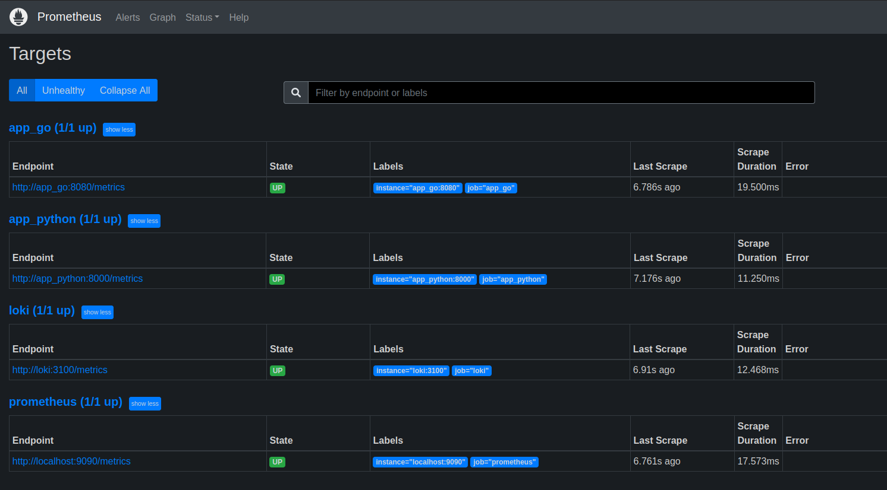
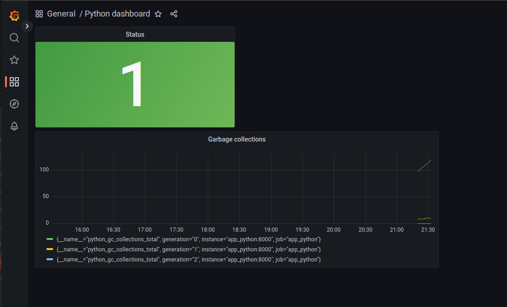
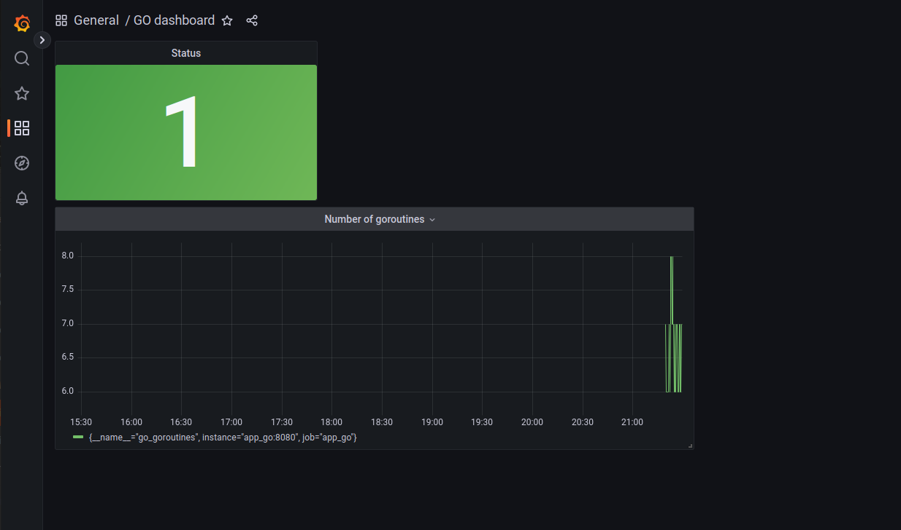
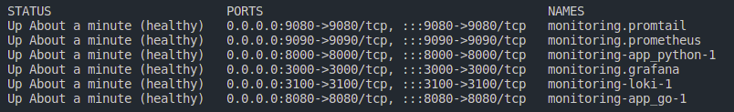

# Metrics

1. Screenshots from <http://localhost:9090/targets> after adding Prometheus:

    

2. Prometheus and Loki Dashboards:

    

    

3. Screenshots from <http://localhost:9090/targets> for all services:

    

4. Metrics from the applications:

    

    

5. Healthchecks

    
