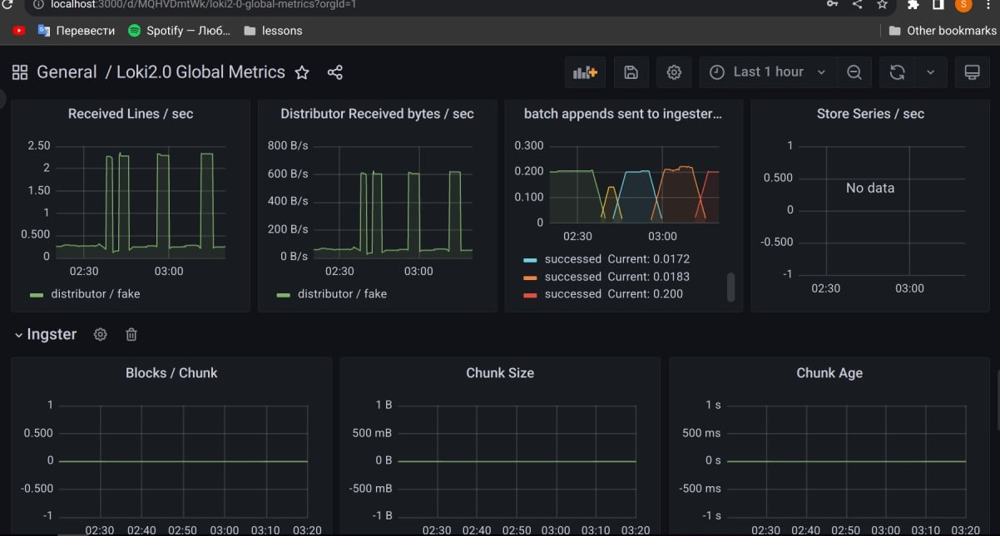
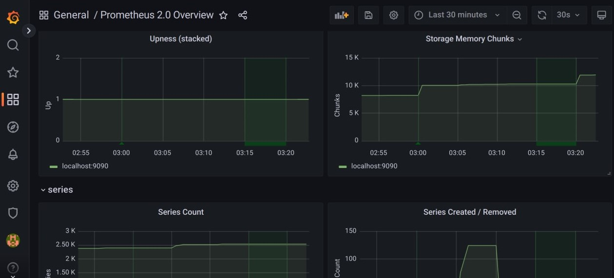

# Metrics lab (prometheus)

## HowToRun

```
docker-compose up -d
```

After starting of all containers you can check:
* graphana - http://localhost:3000
* promtail, loki - http://localhost:3100/ready
* go app - http://localhost:8080
* python app - http://localhost:5000
* prometheus - http://localhost:9090

## Configure Prometheus (6 points)

Checking http://localhost:9090/targets


## Dashboards in Grafana (4 points)

Dashboard in Grafana for Loki:



Dashboard in Grafana for Prometheus:



Also, I added log rotation and mem limits in the docker-compose.yml file.

## Bonus task 

I added health check for python and all other services


