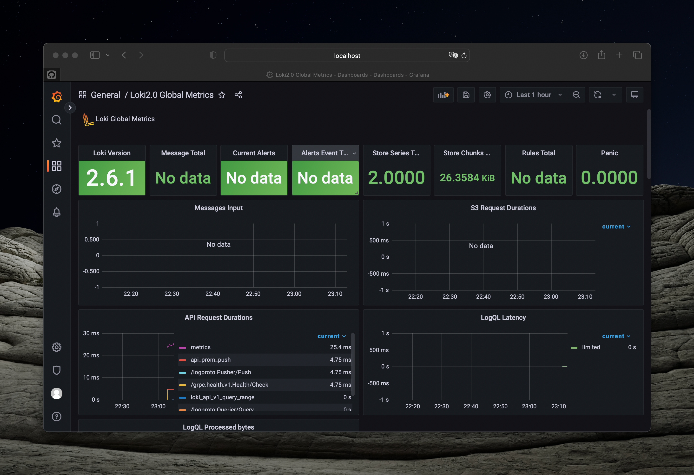

# Metrics

The result of connecting the containers to Prometheus is as follows:

Here are dashboards created in Grafana that output information from Prometheus data source:

> Log rotation was already implemented in the previous lab. You can find it in the `docker-compose.yml` as well.
