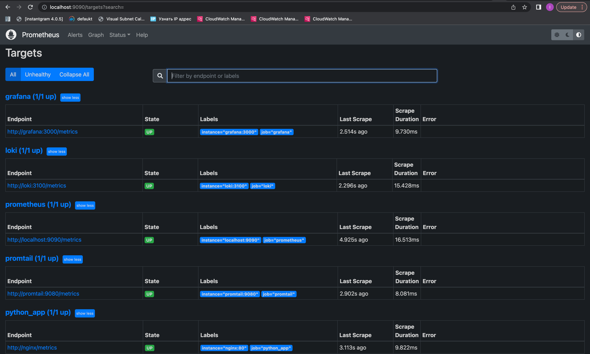
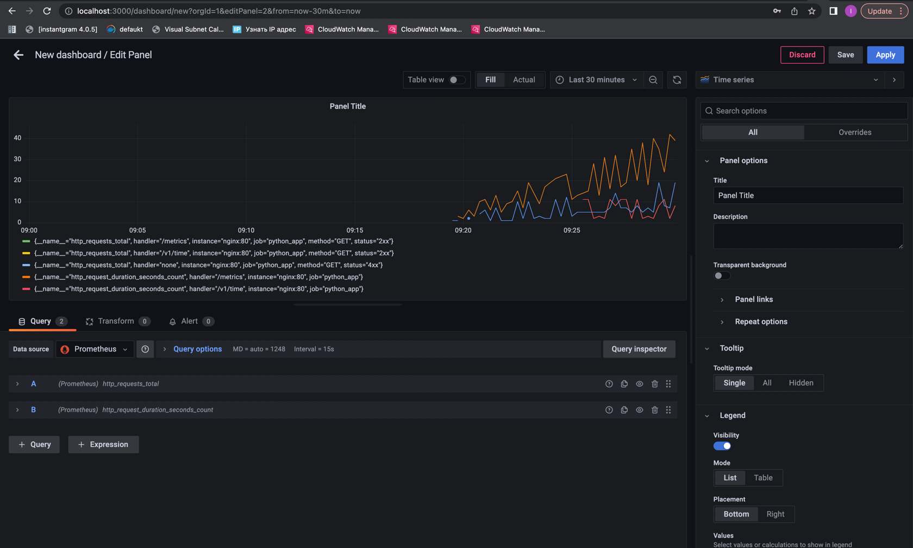

1. I've configured prometheus to gather metrics from each service:

2. After that I've added prometheus as datasource and setup two dashboards:

3. Logs rotation and health checks are working.

4. Also, I use `prometheus_fastapi_instrumentator` (https://github.com/trallnag/prometheus-fastapi-instrumentator) to 
produce metrics from my app. Now I can set up a dashboard:

