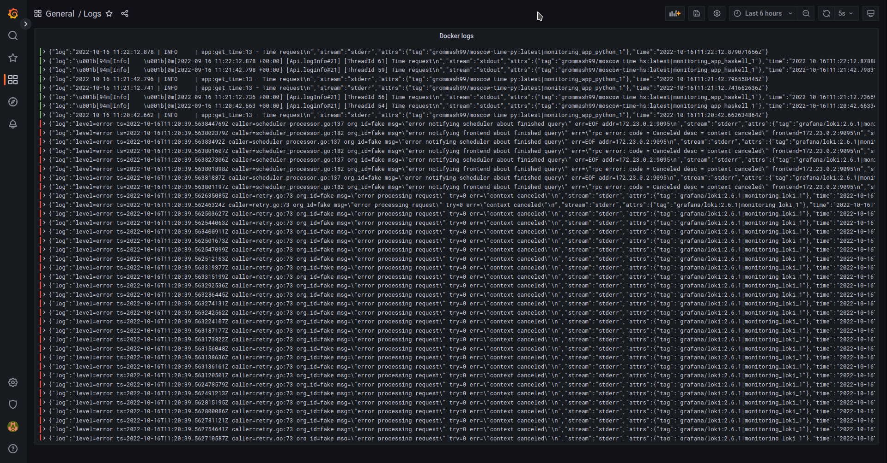
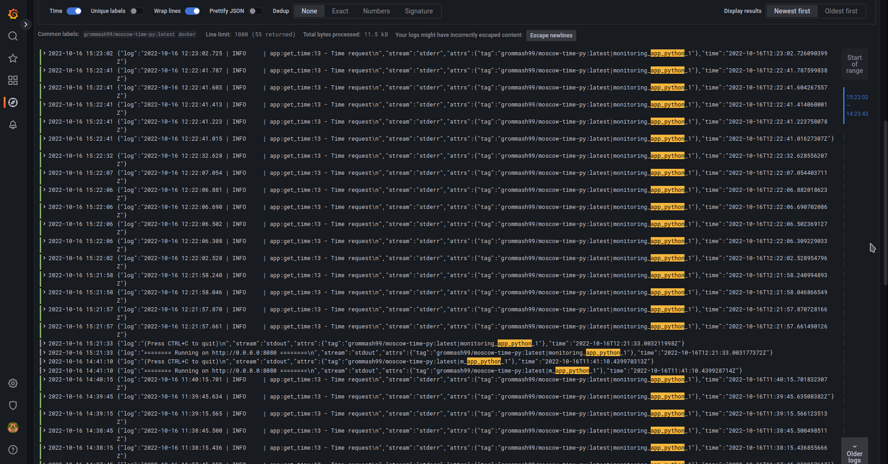

# Monitoring

I have added both `app_python` and `app_haskell` to `docker-compose.yml`.
Logs collected from all docker containers.

## Results

After running infrastructure with monitoring and setting up Grafana,
I have got the following results:

