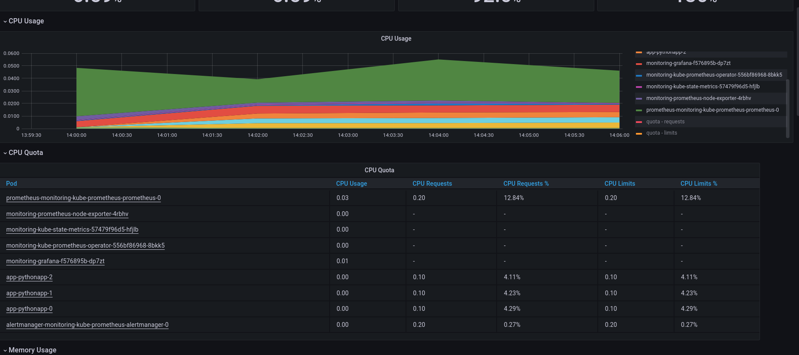
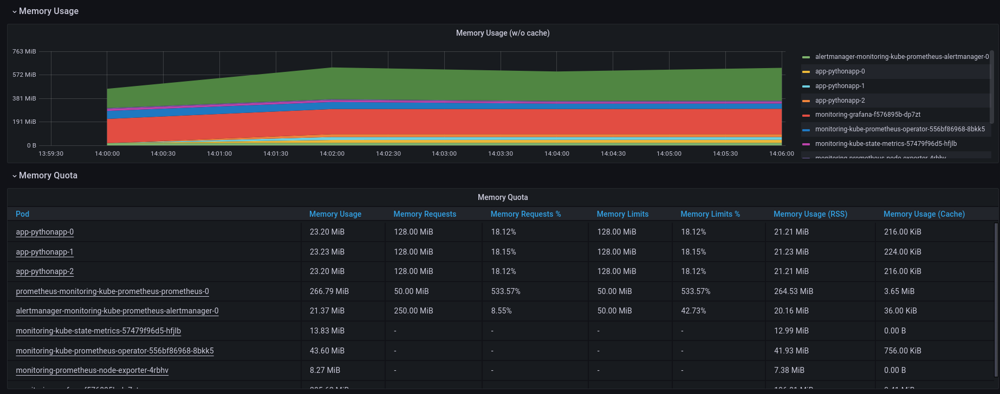
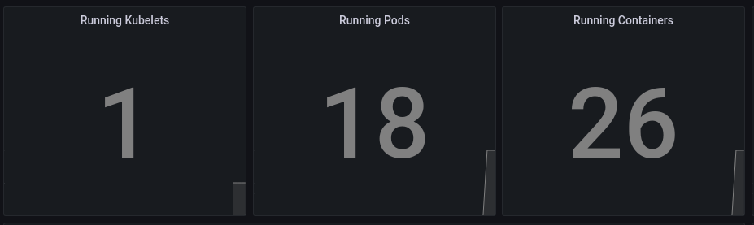
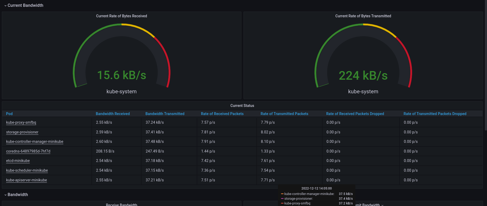

# Lab 14

## Kube Prometheus Stack

* **Prometheus** collects metrics that are lated displayed in Grafana
* **Grafana** is needed to vizualize metrics
* **Prometheus Operator** is needed to automate config of a Prometheus
* **Alertmanager** is needed to manage alerts from users' applications and direct them to support
* **Prometheus node-exporter** is needed to export hradware and system (os) metrics
* **Prometheus Adapter for Kubernetes Metrics APIs** is needed to adapt data for autoscaling 
* **kube-state-metrics** is needed to listen for k8s API and generate metrics
  
```kubectl get po,sts,svc,pvc,cm```

```console
NAME                                                         READY   STATUS    RESTARTS   AGE
pod/alertmanager-kubeprom-kube-prometheus-s-alertmanager-0   2/2     Running   0          44s
pod/python-helm-0                                             1/1     Running   0          45s
pod/python-helm-1                                             1/1     Running   0          45s
pod/python-helm-2                                             1/1     Running   0          45s
pod/kubeprom-grafana-8585b77b54-sl7dq                       3/3     Running   0          45s
pod/kubeprom-kube-prometheus-s-operator-5cc769c855-wqp9m     1/1     Running   0          45s
pod/kubeprom-kube-state-metrics-57ff694d4-8mvbl           1/1     Running   0          45s
pod/kubeprom-prometheus-node-exporter-sdwlz                1/1     Running   0          45s
pod/prometheus-kubeprom-kube-prometheus-s-prometheus-0      2/2     Running   0          43s

NAME                                                                    READY   AGE
statefulset.apps/alertmanager-kubeprom-kube-prometheus-s-alertmanager    1/1     44s
statefulset.apps/python-helm                                             3/3     45s
statefulset.apps/prometheus-kubeprom-kube-prometheus-s-prometheus       1/1     45s

NAME                                              TYPE        CLUSTER-IP       EXTERNAL-IP   PORT(S)                      AGE
service/alertmanager-operated                     ClusterIP   None             <none>        9093/TCP,9094/TCP,9094/UDP   85s
service/python-helm                                ClusterIP   10.110.74.123    <none>        80/TCP                       45s
service/kubeprom-grafana                        ClusterIP   10.111.136.234     <none>        80/TCP                       45s
service/kubeprom-kube-prometheus-alertmanager   ClusterIP   10.111.254.76     <none>        9093/TCP                     45s
service/kubeprom-kube-prometheus-operator       ClusterIP   10.109.197.252   <none>        443/TCP                      45s
service/kubeprom-kube-prometheus-prometheus     ClusterIP   10.102.131.118    <none>        9090/TCP                     45s
service/kubeprom-kube-state-metrics             ClusterIP   10.108.120.158   <none>        8080/TCP                     45s
service/kubeprom-prometheus-node-exporter       ClusterIP   10.111.19.54    <none>        9100/TCP                    45s
service/kubernetes                                ClusterIP   10.96.0.1        <none>        443/TCP                      24d
service/prometheus-operated                       ClusterIP   None             <none>        9090/TCP                     45s

NAME                                        STATUS   VOLUME                                     CAPACITY   ACCESS MODES   STORAGECLASS   AGE
persistentvolumeclaim/visits-hepm-python-0   Bound    pvc-b89eb387-b538-4af4-8e7d-72c07e7a8f1c    256M       RWO            standard       9d
persistentvolumeclaim/visits-hepm-python-1   Bound    pvc-d10y86dq-40fc-mg55-n59u-nj5n589t89t5   256M       RWO            standard       9d
persistentvolumeclaim/visits-hepm-python-2   Bound    pvc-n5kj4j92-5nj2-1mj6-ciej-fnr84ngb8bso   256M       RWO            standard       9d
45AME                                                                     DATA 45AGE
configmap/kubeprom-config                                              1      45s
configmap/kubeprom-grafana                                             2      45s
configmap/kubeprom-grafana-config-dashboards                           2      45s
configmap/kubeprom-grafana-test                                        1      45s
configmap/kubeprom-kube-prometheus-alertmanager-overview               1      45s
configmap/kubeprom-kube-prometheus-apiserver                           1      45s
configmap/kubeprom-kube-prometheus-cluster-total                       1      45s
configmap/kubeprom-kube-prometheus-controller-manager                  1      45s
configmap/kubeprom-kube-prometheus-etcd                                1      45s
configmap/kubeprom-kube-prometheus-grafana-datasource                  1      45s
configmap/kubeprom-kube-prometheus-grafana-overview                    1      45s
configmap/kubeprom-kube-prometheus-k8s-coredns                         1      45s
configmap/kubeprom-kube-prometheus-k8s-resources-cluster               1      45s
configmap/kubepromube-prometheus-k8s-resources-namespace             1      configmap/kubeprom-kube-prometheus-k8s-resources-node                  1      45s
configmap/kubeprom-kube-prometheus-k8s-resources-pod                   1      45s
configmap/kubeprom-kube-prometheus-k8s-resources-workload              1      45s
configmap/kubeprom-kube-prometheus-k8s-resources-workloads-namespace   1      45s
configmap/kubeprom-kube-prometheus-kubelet                             1      45s
configmap/kubeprom-kube-prometheus-namespace-by-pod                    1      45s
configmap/kubeprom-kube-prometheus-namespace-by-workload               1      45s
configmap/kubeprom-kube-prometheus-node-cluster-rsrc-use               1      45s
configmap/kubeprom-kube-prometheus-node-rsrc-use                       1      45s
configmap/kubeprom-kube-prometheus-nodes                               1      45s
configmap/kubeprom-kube-prometheus-nodes-darwin                        1      45s
configmap/kubeprom-kube-prometheus-persistentvolumesusage              1      45s
configmap/kubeprom-kube-prometheus-pod-total                           1      45s
configmap/kubeprom-kube-prometheus-prometheus                          1      45s
configmap/kubeprom-kube-prometheus-proxy                               1      45s
configmap/kubeprom-kube-prometheus-scheduler                           1      45s
configmap/kubeprom-kube-prometheus-workload-total                      1      45s
configmap/kube-root-ca.crt                                               1      24d
configmap/prometheus-kubeprom-kube-prometheus-prometheus-rulefiles-0   29     44s
```

```kubectl get po,sts,svc,pvc,cm```:

* po - list of pods
* sts - list of stateful sets
* svc - list of services
* pvc - list of persistent volume claims
* cm - list of config maps

## Monitoring

### CPU and Memory consumption




### Pods and containers that are actually running

### Network usage

### Alerts

