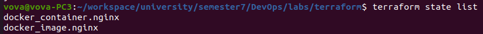
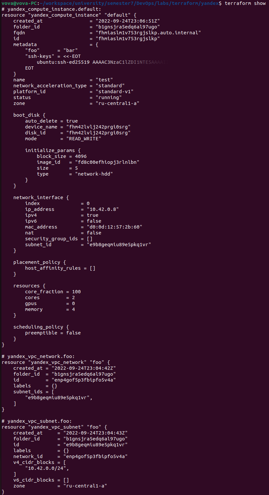
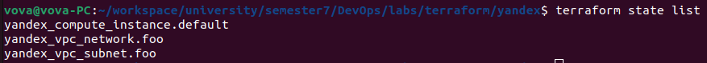
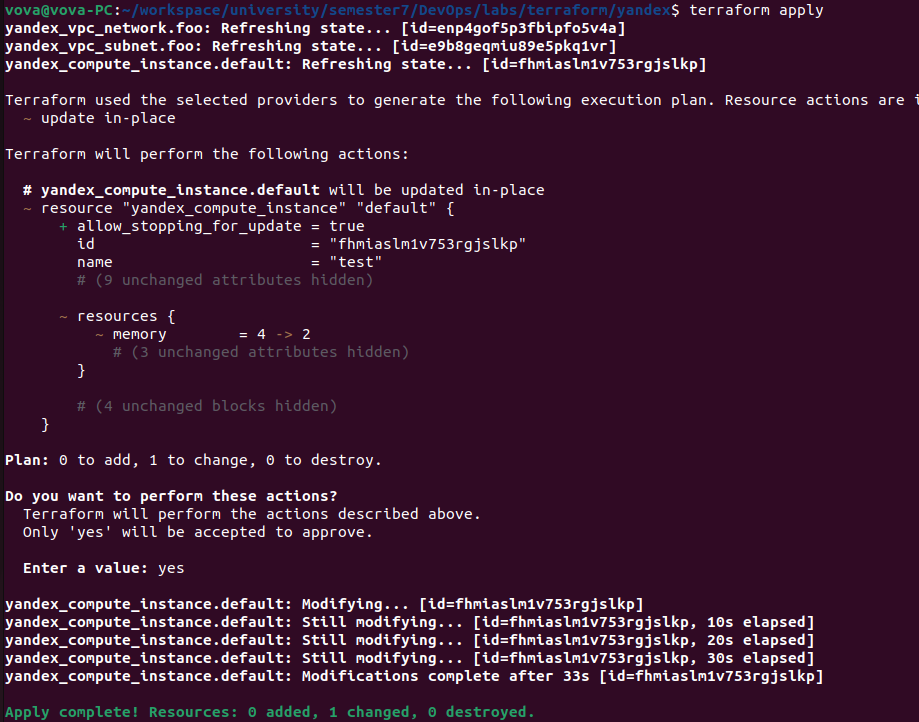
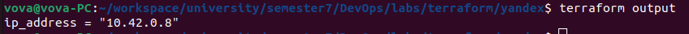
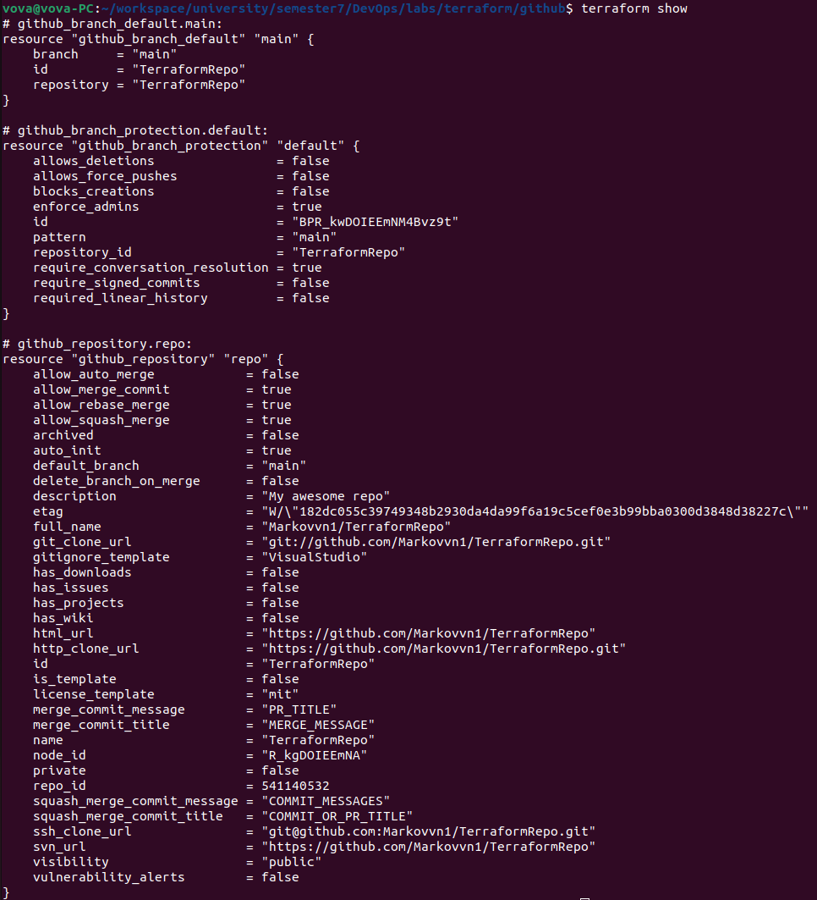
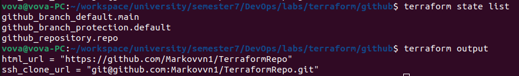
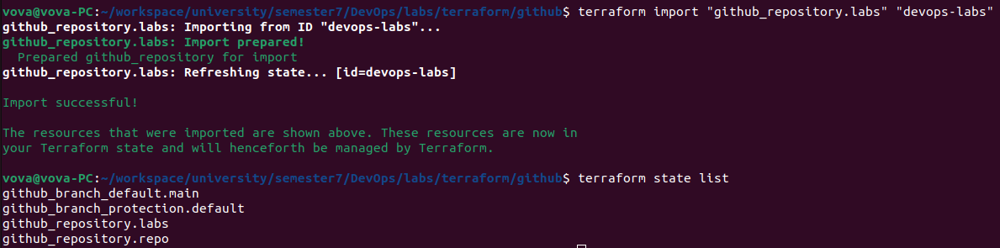
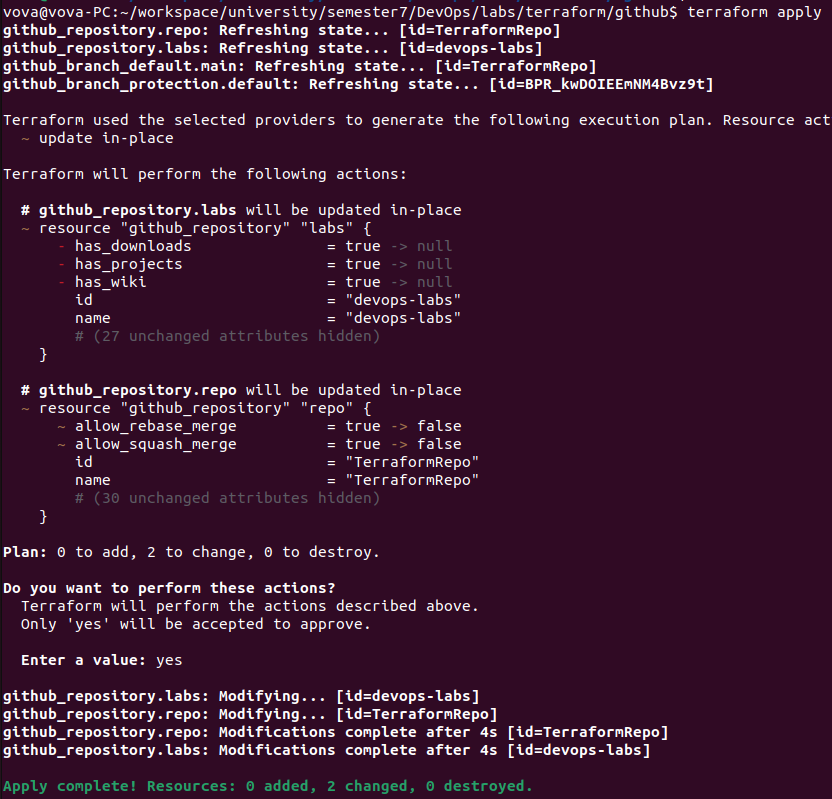

# Terraform reprot

## Docker

Output of the `terraform show`:


Output of the `terraform state list`:



Change Infrastructure:


Output of the `terraform output`:


## Yandex

To run read [manual](https://registry.terraform.io/providers/yandex-cloud/yandex/latest/docs) and use the following command to init environment:

```bash
export YC_TOKEN=...
export YC_CLOUD_ID=...
export YC_FOLDER_ID=...
```

Output of the `terraform show`:



Output of the `terraform state list`:



Change Infrastructure:



Output of the `terraform output`:



## Github

To run read [manual](https://docs.github.com/en/enterprise-server@3.4/authentication/keeping-your-account-and-data-secure/creating-a-personal-access-token) and use the following command to init environment:

```bash
export GITHUB_TOKEN=...
```

Output of the `terraform show`:



Output of the `terraform state list` and `terraform output`:



Import your existing repository using `terraform import` command:



Apply changes from your terraform config to the repository (**disable rebase and squash commits for the repository using terraform**):



## Best practices

* Use `terraform fmt` and `terraform validate` to autoformat and validate terraform files
* Use environment variables for the secrets (not terraform variables)
* Declare outputs and variables in separate files (`outputs.tf` and `variables.tf`)
* Add `terraform.tfstate` to `.gitignore` cause it may contain secret credentials