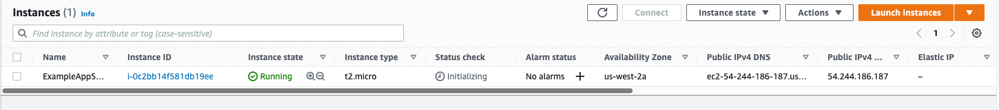

# Infrastructure as code using terraform
## Docker
### Output of `terraform show`

```terraform
# docker_container.nginx:
resource "docker_container" "nginx" {
    attach            = false
    command           = [
        "nginx",
        "-g",
        "daemon off;",
    ]
    cpu_shares        = 0
    entrypoint        = [
        "/docker-entrypoint.sh",
    ]
    env               = []
    gateway           = "172.17.0.1"
    hostname          = "8f514611b636"
    id                = "8f514611b636ce983404e2e3cd414c5032a3799b0f883c0987bfd0daf9a1e035"
    image             = "sha256:0c404972e13056a866875f2bf8a981a911dc17071f505b9dc72cdf08e0d40983"
    init              = false
    ip_address        = "172.17.0.2"
    ip_prefix_length  = 16
    ipc_mode          = "private"
    log_driver        = "json-file"
    logs              = false
    max_retry_count   = 0
    memory            = 0
    memory_swap       = 0
    must_run          = true
    name              = "tutorial"
    network_data      = [
        {
            gateway                   = "172.17.0.1"
            global_ipv6_address       = ""
            global_ipv6_prefix_length = 0
            ip_address                = "172.17.0.2"
            ip_prefix_length          = 16
            ipv6_gateway              = ""
            network_name              = "bridge"
        },
    ]
    network_mode      = "default"
    privileged        = false
    publish_all_ports = false
    read_only         = false
    remove_volumes    = true
    restart           = "no"
    rm                = false
    security_opts     = []
    shm_size          = 64
    start             = true
    stdin_open        = false
    tty               = false

    ports {
        external = 8000
        internal = 80
        ip       = "0.0.0.0"
        protocol = "tcp"
    }
}

# docker_image.nginx:
resource "docker_image" "nginx" {
    id           = "sha256:0c404972e13056a866875f2bf8a981a911dc17071f505b9dc72cdf08e0d40983nginx:latest"
    keep_locally = false
    latest       = "sha256:0c404972e13056a866875f2bf8a981a911dc17071f505b9dc72cdf08e0d40983"
    name         = "nginx:latest"
    repo_digest  = "nginx@sha256:0b970013351304af46f322da1263516b188318682b2ab1091862497591189ff1"
}
```

### Output of `terraform state list`

```
docker_container.nginx
docker_image.nginx
```

### Log of applied changes to infrastructure
```terraform
daniil@Daniils-MacBook-Pro docker % terraform apply
docker_image.nginx: Refreshing state... [id=sha256:0c404972e13056a866875f2bf8a981a911dc17071f505b9dc72cdf08e0d40983nginx:latest]
docker_container.nginx: Refreshing state... [id=d719250a209900fd595668cc99990924b8c4357dda0a6faa2a35637e21e058cb]

Terraform used the selected providers to generate the following execution plan. Resource actions are indicated with the following symbols:
-/+ destroy and then create replacement

Terraform will perform the following actions:

  # docker_container.nginx must be replaced
-/+ resource "docker_container" "nginx" {
      + bridge            = (known after apply)
      ~ command           = [
          - "nginx",
          - "-g",
          - "daemon off;",
        ] -> (known after apply)
      + container_logs    = (known after apply)
      - cpu_shares        = 0 -> null
      - dns               = [] -> null
      - dns_opts          = [] -> null
      - dns_search        = [] -> null
      ~ entrypoint        = [
          - "/docker-entrypoint.sh",
        ] -> (known after apply)
      ~ env               = [] -> (known after apply)
      + exit_code         = (known after apply)
      ~ gateway           = "172.17.0.1" -> (known after apply)
      - group_add         = [] -> null
      ~ hostname          = "d719250a2099" -> (known after apply)
      ~ id                = "d719250a209900fd595668cc99990924b8c4357dda0a6faa2a35637e21e058cb" -> (known after apply)
      ~ init              = false -> (known after apply)
      ~ ip_address        = "172.17.0.2" -> (known after apply)
      ~ ip_prefix_length  = 16 -> (known after apply)
      ~ ipc_mode          = "private" -> (known after apply)
      - links             = [] -> null
      - log_opts          = {} -> null
      - max_retry_count   = 0 -> null
      - memory            = 0 -> null
      - memory_swap       = 0 -> null
        name              = "tutorial"
      ~ network_data      = [
          - {
              - gateway                   = "172.17.0.1"
              - global_ipv6_address       = ""
              - global_ipv6_prefix_length = 0
              - ip_address                = "172.17.0.2"
              - ip_prefix_length          = 16
              - ipv6_gateway              = ""
              - network_name              = "bridge"
            },
        ] -> (known after apply)
      - network_mode      = "default" -> null
      - privileged        = false -> null
      - publish_all_ports = false -> null
      ~ security_opts     = [] -> (known after apply)
      ~ shm_size          = 64 -> (known after apply)
      - sysctls           = {} -> null
      - tmpfs             = {} -> null
        # (12 unchanged attributes hidden)

      + healthcheck {
          + interval     = (known after apply)
          + retries      = (known after apply)
          + start_period = (known after apply)
          + test         = (known after apply)
          + timeout      = (known after apply)
        }

      + labels {
          + label = (known after apply)
          + value = (known after apply)
        }

      ~ ports {
          ~ external = 8081 -> 8082 # forces replacement
            # (3 unchanged attributes hidden)
        }
    }

Plan: 1 to add, 0 to change, 1 to destroy.
╷
│ Warning: Deprecated attribute
│ 
│   on main.tf line 18, in resource "docker_container" "nginx":
│   18:   image = docker_image.nginx.latest
│ 
│ The attribute "latest" is deprecated. Refer to the provider documentation for details.
│ 
│ (and one more similar warning elsewhere)
╵

Do you want to perform these actions?
  Terraform will perform the actions described above.
  Only 'yes' will be accepted to approve.

  Enter a value: yes

docker_container.nginx: Destroying... [id=d719250a209900fd595668cc99990924b8c4357dda0a6faa2a35637e21e058cb]
docker_container.nginx: Destruction complete after 1s
docker_container.nginx: Creating...
docker_container.nginx: Creation complete after 0s [id=aba2ca1cc33aaa8a15adb3908c3675953e15fccc8efcb3e3498ea5268d23c5a9]
╷
│ Warning: Deprecated attribute
│ 
│   on main.tf line 18, in resource "docker_container" "nginx":
│   18:   image = docker_image.nginx.latest
│ 
│ The attribute "latest" is deprecated. Refer to the provider documentation for details.
│ 
│ (and one more similar warning elsewhere)
╵

Apply complete! Resources: 1 added, 0 changed, 1 destroyed.
```

### Output of the `terraform output` command
```terraform
container_id = "c4a70e47d5bbdc7652744876e5bbeee967cbcda081cb459f65814c2117c0ea4e"
image_id = "sha256:0c404972e13056a866875f2bf8a981a911dc17071f505b9dc72cdf08e0d40983nginx:latest"
```

## AWS

### Output of `terraform show`
```terraform
daniil@Daniils-MacBook-Pro aws % terraform show
# aws_instance.app_server:
resource "aws_instance" "app_server" {
    ami                                  = "ami-830c94e3"
    arn                                  = "arn:aws:ec2:us-west-2:350668287710:instance/i-0c2bb14f581db19ee"
    associate_public_ip_address          = true
    availability_zone                    = "us-west-2a"
    cpu_core_count                       = 1
    cpu_threads_per_core                 = 1
    disable_api_stop                     = false
    disable_api_termination              = false
    ebs_optimized                        = false
    get_password_data                    = false
    hibernation                          = false
    id                                   = "i-0c2bb14f581db19ee"
    instance_initiated_shutdown_behavior = "stop"
    instance_state                       = "running"
    instance_type                        = "t2.micro"
    ipv6_address_count                   = 0
    ipv6_addresses                       = []
    monitoring                           = false
    primary_network_interface_id         = "eni-0ca7dd8a3f8dd28c1"
    private_dns                          = "ip-172-31-26-49.us-west-2.compute.internal"
    private_ip                           = "172.31.26.49"
    public_dns                           = "ec2-54-244-186-187.us-west-2.compute.amazonaws.com"
    public_ip                            = "54.244.186.187"
    secondary_private_ips                = []
    security_groups                      = [
        "default",
    ]
    source_dest_check                    = true
    subnet_id                            = "subnet-0f3e19d45bcfae81b"
    tags                                 = {
        "Name" = "ExampleAppServerInstance"
    }
    tags_all                             = {
        "Name" = "ExampleAppServerInstance"
    }
    tenancy                              = "default"
    user_data_replace_on_change          = false
    vpc_security_group_ids               = [
        "sg-03098e6e0d97add10",
    ]

    capacity_reservation_specification {
        capacity_reservation_preference = "open"
    }

    credit_specification {
        cpu_credits = "standard"
    }

    enclave_options {
        enabled = false
    }

    maintenance_options {
        auto_recovery = "default"
    }

    metadata_options {
        http_endpoint               = "enabled"
        http_put_response_hop_limit = 1
        http_tokens                 = "optional"
        instance_metadata_tags      = "disabled"
    }

    private_dns_name_options {
        enable_resource_name_dns_a_record    = false
        enable_resource_name_dns_aaaa_record = false
        hostname_type                        = "ip-name"
    }

    root_block_device {
        delete_on_termination = true
        device_name           = "/dev/sda1"
        encrypted             = false
        iops                  = 0
        tags                  = {}
        throughput            = 0
        volume_id             = "vol-0e635dd4432786711"
        volume_size           = 8
        volume_type           = "standard"
    }
}

```
Instance was created **successfully**: 


### Output of `terraform state list`
```terraform
aws_instance.app_server
```

### Log of applied changes to infrastructure
```terraform
aws_instance.app_server: Refreshing state... [id=i-0c2bb14f581db19ee]

Terraform used the selected providers to generate the following execution plan. Resource actions are indicated with the following symbols:
  ~ update in-place

Terraform will perform the following actions:

  # aws_instance.app_server will be updated in-place
  ~ resource "aws_instance" "app_server" {
        id                                   = "i-0c2bb14f581db19ee"
      ~ tags                                 = {
          ~ "Name" = "ExampleAppServerInstance" -> "DaniilLivitinsInstance"
        }
      ~ tags_all                             = {
          ~ "Name" = "ExampleAppServerInstance" -> "DaniilLivitinsInstance"
        }
        # (29 unchanged attributes hidden)

        # (7 unchanged blocks hidden)
    }

Plan: 0 to add, 1 to change, 0 to destroy.

Do you want to perform these actions?
  Terraform will perform the actions described above.
  Only 'yes' will be accepted to approve.

  Enter a value: yes

aws_instance.app_server: Modifying... [id=i-0c2bb14f581db19ee]
aws_instance.app_server: Modifications complete after 5s [id=i-0c2bb14f581db19ee]

Apply complete! Resources: 0 added, 1 changed, 0 destroyed.
```

### Output of the `terraform output` command
```terraform
instance = "i-0c2bb14f581db19ee"
```

## Github(with bonus task)

### How to import my module?
1) `terraform init`
2) `terraform import "github_repository.repo" "devops_labs"`
3) `terraform plan -out plan.tfplan`
4) `terraform apply "plan.tfplan"`

## Best practices
* Keep tokens as environmental variable 
* Organize all outputs in an outputs.tf file
* Start every module with a main.tf file, where resources are located by default.
* Declare all variables in `variables.tf`
* Use `.gitignore`