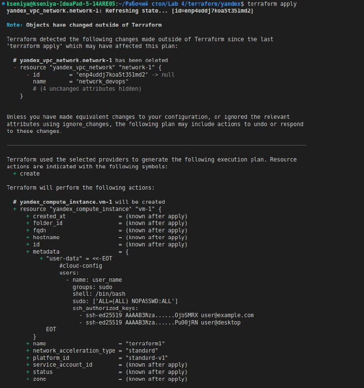
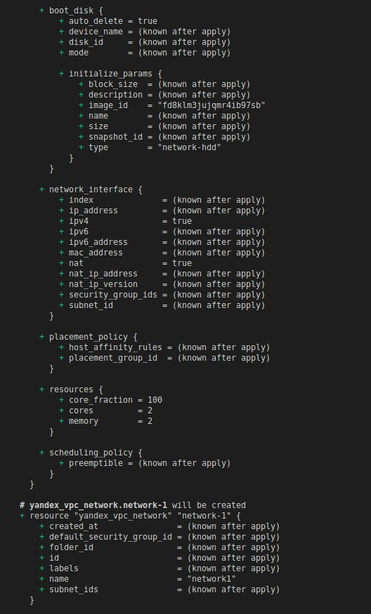
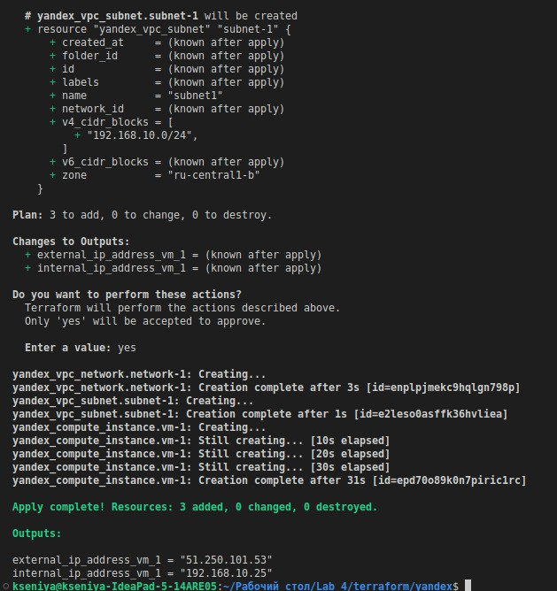
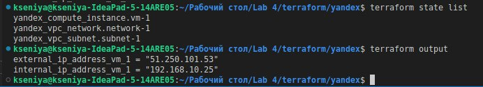

# Terraform. Infrastructure as code

This Lab I will use Terraform to build Docker, Yandex Cloud and GitHub infrastructure.

## Best practices that were applied

- Terraform code is split out into modules, to promote consistent reuse of your organization's more common architectural patterns.
    1. main.tf file is provided
    1. output.tf file is used for the output values
    1. variables.tf file with specified for the terraform variables with clear names

- Infrastructure configuration is consistent, with all necessary details fully documented

- Users across the organization can safely provision infrastructure with Terraform, without conflicts and with clear understanding of their access permissions.

- Machine images in a maintainable and repeatable way
- Description for the variables is used
- There are several folders, each of them is specified for the concrete infrastructure
- .gitignore is used

## The Docker infrastructure

For building a Docker infrastructure I have followed [this tutorial](https://learn.hashicorp.com/collections/terraform/docker-get-started). I have formatted and validated it by using **terraform fmt**  and **terraform validate**.  
Then, I applied the configuration.
Also, the variables.tf was used to parameterize the Terraform configuration and to make configuration more dynamic and flexible.  
The output.tf was configured to organize data to be easily queried and displayed to the Terraform user.  
Lastly, I applied the new changes once again. This step is to show that Infrastructure is continuously evolving, while Terraform helps to build an execution with only necessary modifications in order to reach the desired state. In the screens below you can see the changes:

  

  

  

The result of the following command:

```terminal
    terraform show

    # yandex_compute_instance.vm-1:
    resource "yandex_compute_instance" "vm-1" {
        created_at                = "2022-10-28T01:09:39Z"
        folder_id                 = "b1gb8nhhoqdm6orr8rf9"
        fqdn                      = "epd70o89k0n7piric1rc.auto.internal"
        id                        = "epd70o89k0n7piric1rc"
        metadata                  = {
            "user-data" = <<-EOT
                #cloud-config
                users:
                - name: user_name
                    groups: sudo
                    shell: /bin/bash
                    sudo: ['ALL=(ALL) NOPASSWD:ALL']
                    ssh_authorized_keys:
                    - ssh-ed25519 AAAAB3Nza......OjbSMRX user@example.com
                    - ssh-ed25519 AAAAB3Nza......Pu00jRN user@desktop
            EOT
        }
        name                      = "terraform1"
        network_acceleration_type = "standard"
        platform_id               = "standard-v1"
        status                    = "running"
        zone                      = "ru-central1-b"

        boot_disk {
            auto_delete = true
            device_name = "epdbcqd5jhcnl63a9dis"
            disk_id     = "epdbcqd5jhcnl63a9dis"
            mode        = "READ_WRITE"

            initialize_params {
                block_size = 4096
                image_id   = "fd8klm3jujqmr4ib97sb"
                size       = 3
                type       = "network-hdd"
            }
        }

        network_interface {
            index              = 0
            ip_address         = "192.168.10.25"
            ipv4               = true
            ipv6               = false
            mac_address        = "d0:0d:70:61:09:a0"
            nat                = true
            nat_ip_address     = "51.250.101.53"
            nat_ip_version     = "IPV4"
            security_group_ids = []
            subnet_id          = "e2leso0asffk36hvliea"
        }

        placement_policy {
            host_affinity_rules = []
        }

        resources {
            core_fraction = 100
            cores         = 2
            gpus          = 0
            memory        = 2
        }

        scheduling_policy {
            preemptible = false
        }
    }

    # yandex_vpc_network.network-1:
    resource "yandex_vpc_network" "network-1" {
        created_at = "2022-10-28T01:09:36Z"
        folder_id  = "b1gb8nhhoqdm6orr8rf9"
        id         = "enplpjmekc9hqlgn798p"
        labels     = {}
        name       = "network1"
        subnet_ids = []
    }

    # yandex_vpc_subnet.subnet-1:
    resource "yandex_vpc_subnet" "subnet-1" {
        created_at     = "2022-10-28T01:09:37Z"
        folder_id      = "b1gb8nhhoqdm6orr8rf9"
        id             = "e2leso0asffk36hvliea"
        labels         = {}
        name           = "subnet1"
        network_id     = "enplpjmekc9hqlgn798p"
        v4_cidr_blocks = [
            "192.168.10.0/24",
        ]
        v6_cidr_blocks = []
        zone           = "ru-central1-b"
    }


    Outputs:

    external_ip_address_vm_1 = "51.250.101.53"
    internal_ip_address_vm_1 = "192.168.10.25"
```

Using Input variables I renamed my docker container and got an output from **terraform apply** after these changes.  

I finished this tutorial with **terraform state list** and **terraform output** commands:
  

## The Yandex Cloud infrastructure

For building a Yandex Cloud infrastructure I have followed [this tutorial](https://cloud.yandex.ru/docs/tutorials/infrastructure-management/terraform-quickstart).
